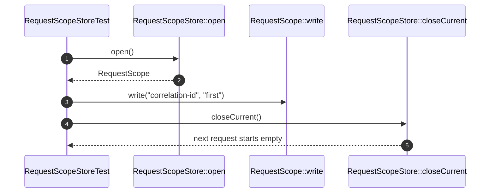

# Request Scope How This Works

## What this folder is

This folder owns request-local mutable state and the store that opens and closes that state explicitly.

## Real commands or triggers that reach this folder

- `$application->http()->handle(...)`
- `vendor/bin/phpunit tests/Unit/Framework/System/Capabilities/RequestScope`

## Exact upstream handoffs

- `Flows/HandleIncomingHttp/OpenHttpRequestScope.php`
- function: `OpenHttpRequestScope::open(...)`
- `OpenHttpRequestScope.php` -> `RequestScopeStore::open()`

## The simplest story

- the HTTP flow opens a new scope for one request.
- code writes and reads request-local values through that scope.
- the flow closes the scope so the next request starts clean.

## The first important path

When you type:

```bash
vendor/bin/phpunit tests/Unit/Framework/System/Capabilities/RequestScope/RequestScopeStoreTest.php
```

the important path is:



- **Step 1:** the store opens a request scope.
- **Step 2:** request-local values are written into that scope.
- **Step 3:** the current scope is closed.
- **Step 4:** the next request cannot see the old values.

## Direct files in this folder

### RequestScopeStore.php

This is the file where active request scope lifecycle is controlled.

When the story opens this file:

- `HandleIncomingHttp::handle(...)` -> `OpenHttpRequestScope::open(...)` -> `RequestScopeStore.php`

What arrives here:

- a new request boundary
- the need to prevent cross-request leaks

What leaves this file:

- one active scope
- a closed or reset state after the request ends

Why you open it first:

- two requests see the same scoped value
- closing a request does not clear the active scope

## Child folders in this folder

### none

Open the direct files in this folder.

Use it when:

- request-local state is wrong
- scope lifecycle is wrong

## Debug first

- start in `RequestScopeStore::open()` when scope creation fails
- start in `RequestScope::close()` when closed scopes still expose old values

## What to remember

- request-local mutation belongs here.
- closed scopes are not reusable.
- reset delegates to the store instead of clearing globals.

## Dictionary

<a id="dictionary-scope"></a>

- `request scope`: one isolated mutable state boundary for one request
