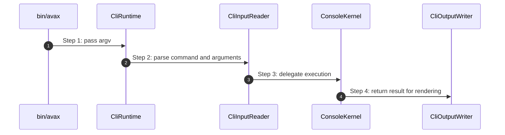

# CLI Runtime How This Works

## What this folder is

This folder owns the adapter that turns raw `argv` input into a framework console result.

## Real commands or triggers that reach this folder

- `php bin/avax <command>`

## Exact upstream handoffs

- `bin/avax`
- function: `CliRuntime::run(...)`
- `CliRuntime::run(...)` -> `ConsoleKernel::run(...)`

## The simplest story

- read CLI input
- delegate to the console public surface
- render the runtime result for stdout

## The first important path

When you type:

```bash
php bin/avax ping
```

the important path is:



## What gets written changed or executed

- one command is selected and executed
- stdout rendering happens only after the console kernel returns a result

## Failure path

- missing commands or command errors surface through runtime results and explicit flow failures

## What user sees

- rendered console output and exit code

## Where to debug first

- `framework/System/Capabilities/Runtime/Cli/CliInputReader.php`
- `framework/System/Capabilities/Runtime/Cli/CliRuntime.php`
- `framework/System/Capabilities/Runtime/Cli/CliOutputWriter.php`
