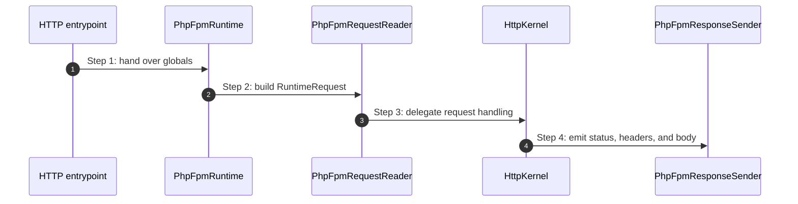

# PHP-FPM Runtime How This Works

## What this folder is

This folder owns the adapter that reads PHP globals into a runtime request and sends the resulting framework response back to PHP-FPM output primitives.

## Real commands or triggers that reach this folder

- `public/index.php`
- any HTTP entrypoint that delegates to the framework HTTP kernel under PHP-FPM semantics

## Exact upstream handoffs

- HTTP bootstrap
- function: `PhpFpmRuntime::handleGlobals(...)`
- `PhpFpmRuntime::handleGlobals(...)` -> `HttpKernel::handle(...)`
- `PhpFpmRuntime::send(...)` -> PHP header/body output

## The simplest story

- convert globals into `RuntimeRequest`
- delegate to the HTTP public surface
- emit status, headers, and body

## The first important path

When the web server invokes:

```bash
GET /health
```

the important path is:



## What gets written changed or executed

- request metadata is normalized into runtime form
- HTTP status and headers are emitted through PHP output functions

## Failure path

- missing HTTP handler is a framework misconfiguration
- response emission bugs should be debugged at the sender boundary

## What user sees

- the final HTTP response only

## Where to debug first

- `framework/System/Capabilities/Runtime/PhpFpm/PhpFpmRequestReader.php`
- `framework/System/Capabilities/Runtime/PhpFpm/PhpFpmRuntime.php`
- `framework/System/Capabilities/Runtime/PhpFpm/PhpFpmResponseSender.php`
