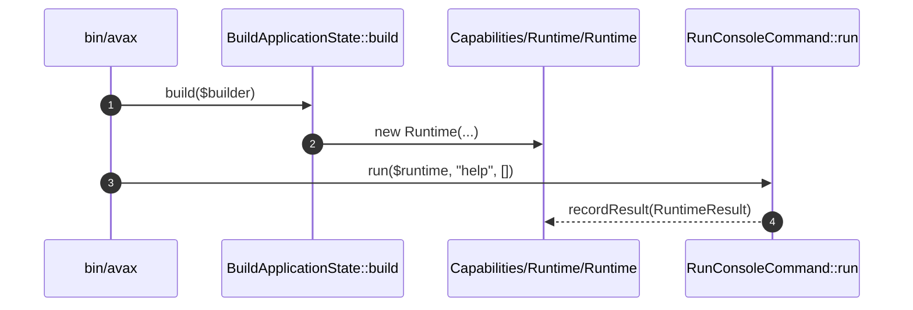

# Runtime Capability How This Works

## What this folder is

This folder owns runtime-neutral request, response, result, state, context, and adapter types.

## Real commands or triggers that reach this folder

- `Avax::boot(...)`
- `$application->http()->handle(...)`
- `bin/avax help`

## Exact upstream handoffs

- `Flows/BootApplication/BuildApplicationState.php`
- function: `BuildApplicationState::build(...)`
- `BuildApplicationState.php` -> `Capabilities/Runtime/Runtime.php`

## The simplest story

- boot builds `RuntimeState`, `RuntimeContext`, and the runtime aggregate.
- HTTP and CLI flows read and write explicit runtime state.
- runtime adapters call public kernels without leaking external APIs inward.

## The first important path

When you type:

```bash
bin/avax help
```

the important path is:



- **Step 1:** boot creates the runtime aggregate.
- **Step 2:** explicit state holders are attached to that aggregate.
- **Step 3:** a flow uses the runtime without touching globals.
- **Step 4:** the context records the result for later reset.

## Direct files in this folder

### Runtime.php

This is the aggregate that exposes the assembled runtime graph.

When the story opens this file:

- `Avax::boot(...)` -> `BuildApplicationState::build(...)` -> `Runtime.php`

What arrives here:

- state holders
- component registry
- handlers and adapter inputs

What leaves this file:

- a single runtime object for public kernels and flows

Why you open it first:

- the wrong handler or command catalog is visible at runtime
- state reset seems registered but not reachable

## Child folders in this folder

### PhpFpm/

Open `../Runtime/how-this-works.md`.

Use it when:

- HTTP adapter code is under review
- request extraction from server arrays changes

### Cli/

Open `../Runtime/how-this-works.md`.

Use it when:

- CLI argv parsing changes
- stdout rendering is wrong

## Debug first

- start in `BuildApplicationState::build(...)` when runtime composition is incomplete
- start in `RuntimeContext::resetState()` when a worker-safe reset does not clear visible state

## What to remember

- `RuntimeState` is lifecycle state.
- `RuntimeContext` is explicit per-execution context.
- adapters consume public kernels, not component internals.

## Dictionary

<a id="dictionary-runtime-context"></a>

- `runtime context`: explicit per-execution data such as the active request or last result
