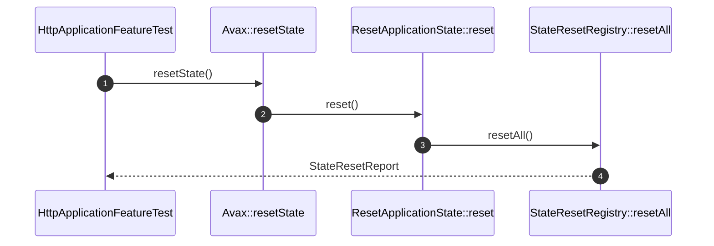

# State Reset How This Works

## What this folder is

This folder owns the registry and report objects that reset framework-held mutable state between executions.

## Real commands or triggers that reach this folder

- `$application->resetState()`
- `vendor/bin/phpunit tests/Feature/Framework/HttpApplicationFeatureTest.php`

## Exact upstream handoffs

- `PublicSurface/Avax.php`
- function: `Avax::resetState()`
- `Avax.php` -> `Flows/ResetApplicationState/ResetApplicationState::reset()`

## The simplest story

- boot registers resettable states.
- `resetState()` resets each registered state.
- the flow returns a report or throws `StateResetFailed`.

## The first important path

When you type:

```bash
vendor/bin/phpunit tests/Feature/Framework/HttpApplicationFeatureTest.php
```

the important path is:



- **Step 1:** the caller asks for a runtime reset.
- **Step 2:** the reset flow delegates to the registry.
- **Step 3:** each resettable state is invoked.
- **Step 4:** the caller receives a success or failure report.

## Direct files in this folder

### StateResetRegistry.php

This is the file where resettable states are registered and reset.

When the story opens this file:

- `BuildApplicationState::build(...)` -> `StateResetRegistry::register(...)` -> `StateResetRegistry.php`

What arrives here:

- resettable framework state holders
- a reset boundary between requests or commands

What leaves this file:

- a `StateResetReport`
- explicit failures instead of silent state leaks

Why you open it first:

- reset succeeds but state remains visible
- one broken resettable state hides another failure

## Child folders in this folder

### none

Open the direct files in this folder.

Use it when:

- reset behavior is under review
- worker safety is under review

## Debug first

- start in `StateResetRegistry::resetAll()` when reset reports are incomplete
- start in `ResetApplicationState::reset()` when failures are swallowed or mislabeled

## What to remember

- reset is explicit.
- failures are reported, not ignored.
- request safety depends on this boundary in worker-style runtimes.

## Dictionary

<a id="dictionary-state-reset"></a>

- `state reset`: explicit clearing of framework-held mutable state between executions
