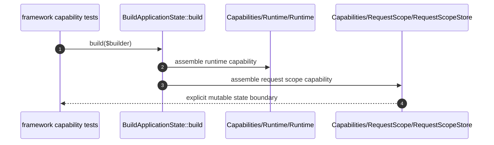

# Capabilities How This Works

## What this folder is

This folder groups the reusable framework mechanisms that multiple flows depend on.

## Real commands or triggers that reach this folder

- `Avax::boot(...)`
- `$application->http()->handle(...)`
- `$application->resetState()`

## Exact upstream handoffs

- `Flows/BootApplication/BuildApplicationState.php`
- function: `BuildApplicationState::build(...)`
- `BuildApplicationState.php` -> `Capabilities/*`

## The simplest story

- boot assembles capability objects.
- flows call those capabilities.
- capability state stays explicit and resettable.

## The first important path

When you type:

```bash
vendor/bin/phpunit tests/Unit/Framework/System/Capabilities
```

the important path is:



- **Step 1:** boot assembles reusable framework mechanisms.
- **Step 2:** runtime and scope capabilities become explicit objects.
- **Step 3:** flows depend on those objects.
- **Step 4:** tests verify behavior at the capability boundary.

## Direct files in this folder

### how-this-works.md

This is the index for framework capabilities.

When the story opens this file:

- `BuildApplicationState::build(...)` -> `Capabilities/how-this-works.md`

What arrives here:

- the need to know which reusable mechanisms exist

What leaves this file:

- the map to runtime, request scope, state reset, and component registry

Why you open it first:

- a new flow needs a reusable mechanism
- a capability starts looking like a runtime owner

## Child folders in this folder

### Runtime/

Open `Runtime/how-this-works.md`.

Use it when:

- runtime state or adapters change
- CLI and HTTP behavior diverge

### RequestScope/

Open `RequestScope/how-this-works.md`.

Use it when:

- request-local data leaks
- scope lifecycle changes

### StateReset/

Open `StateReset/how-this-works.md`.

Use it when:

- reset behavior changes
- worker safety changes

### ComponentRegistry/

Open `ComponentRegistry/how-this-works.md`.

Use it when:

- provider registration changes
- component ownership is unclear

## Debug first

- start in `BuildApplicationState::build(...)` when a capability is missing
- start in the specific child folder when one capability behaves incorrectly

## What to remember

- capabilities are reusable mechanisms.
- flows own order.
- public surface owns entrypoints.

## Dictionary

<a id="dictionary-capability"></a>

- `capability`: a reusable framework mechanism with explicit ownership
