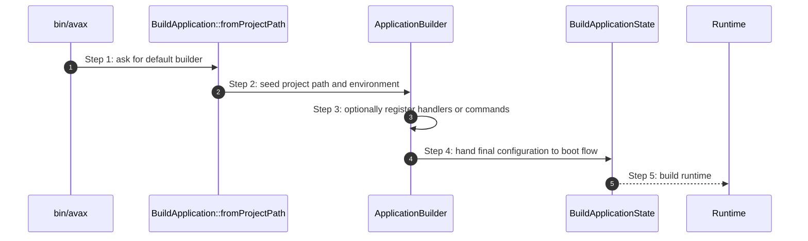

# BuildApplication How This Works

## What this folder is

This folder owns the concrete builder API for framework boot.
It is the stable place where callers declare runtime name, environment, HTTP handler, console commands, and component providers.
It also owns the framework-facing DSL for choosing between raw HTTP callbacks and route-backed HTTP configuration.

## Real commands or triggers that reach this folder

- `Avax::boot(...)`
- `BuildApplication::fromProjectPath(...)`
- `bin/avax`

## Exact upstream handoffs

- `framework/System/PublicSurface/Avax.php`
- function: `Avax::boot(...)`
- `BuildApplication::fromProjectPath(...)` -> `ApplicationBuilder`
- `ApplicationBuilder` -> `BuildApplicationState::build(...)`

## The simplest story

- caller creates a builder from project path
- builder captures explicit runtime inputs through fluent methods
- boot flow consumes the final builder snapshot

## The first important path

When you type:

```bash
php bin/avax ping
```

the important path is:



- **Step 1:** the caller chooses a project root
- **Step 2:** the builder becomes the immutable configuration owner
- **Step 3:** fluent methods clone and refine the builder
- **Step 4:** boot flow converts that configuration into runtime state

## What gets written changed or executed

- builder clones are created
- closures for HTTP and console entrypoints are stored
- `withHttpRoutes(...)` and `withHttpRouteDefinitions(...)` assemble a route-backed HTTP handler without moving route execution into the builder itself
- no request is executed in this folder

## Failure path

- malformed runtime inputs become boot failures when the build flow materializes the runtime

## What user sees

- end users do not see this folder directly
- framework authors see it as the public configuration DSL

## Where to debug first

- `framework/System/Configuration/BuildApplication/BuildApplication.php`
- `framework/System/Configuration/BuildApplication/ApplicationBuilder.php`

## Which terms are easy to confuse here

- `BuildApplication` is the static entry helper
- `ApplicationBuilder` is the immutable configuration carrier
- `withHttpHandler(...)` keeps the low-level callback escape hatch
- `withHttpRoutes(...)` loads an existing route file through the framework bridge
- `withHttpRouteDefinitions(...)` registers routes programmatically through the same bridge
