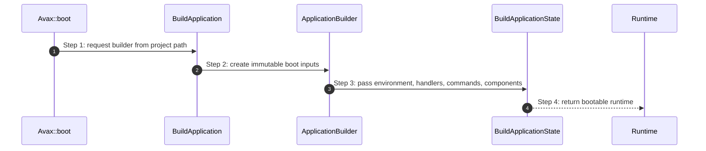

# Configuration How This Works

## What this folder is

This folder owns framework assembly rules.
It turns stable inputs such as project path, environment, runtime name, and handlers into one bootable runtime configuration.

## Real commands or triggers that reach this folder

- `Avax::boot(...)`
- `bin/avax`
- any HTTP or console bootstrap that builds the framework runtime before handling work

## Exact upstream handoffs

- `framework/System/PublicSurface/Avax.php`
- function: `Avax::boot(...)`
- `Avax::boot(...)` -> `BootApplication::boot(...)`
- `BootApplication::boot(...)` -> `BuildApplicationState::build(...)`
- `BuildApplicationState::build(...)` -> `ApplicationBuilder` data from this folder

## The simplest story

- public surface asks for a framework instance
- configuration units hold the boot inputs without executing request logic
- boot flow reads those inputs and produces one runtime object

## The first important path

When you type:

```bash
php bin/avax ping
```

the important path is:



- **Step 1:** public surface asks for a builder
- **Step 2:** configuration captures explicit inputs
- **Step 3:** boot flow translates inputs into runtime state
- **Step 4:** the runtime becomes available to HTTP and console kernels

## What gets written changed or executed

- builder clones are created as configuration changes are applied
- no request handling is executed here
- no mutable request state is stored here

## Failure path

- invalid or missing boot inputs surface later as `ApplicationBootFailed` or framework misconfiguration errors

## What user sees

- successful configuration is invisible to the user
- bad configuration appears as boot failure before any request or command is executed

## Where to debug first

- start in `framework/System/Configuration/BuildApplication/ApplicationBuilder.php`
- then follow `framework/System/Flows/BootApplication/BuildApplicationState.php`

## Which terms are easy to confuse here

- `Configuration` assembles inputs
- `Flows` execute lifecycle behavior
- `PublicSurface` exposes entrypoints but does not own boot internals
