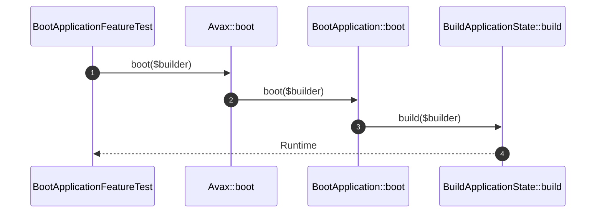

# Boot Application How This Works

## What this folder is

This folder owns the framework boot flow.

## Real commands or triggers that reach this folder

- `Avax::boot(...)`
- `bin/avax help`

## Exact upstream handoffs

- `PublicSurface/Avax.php`
- function: `Avax::boot(...)`
- `Avax.php` -> `BootApplication::boot(...)`

## The simplest story

- boot receives `ApplicationBuilder`.
- `BuildApplicationState` assembles the runtime graph.
- boot either returns the runtime or throws `ApplicationBootFailed`.

## The first important path

When you type:

```bash
vendor/bin/phpunit tests/Feature/Framework/BootApplicationFeatureTest.php
```

the important path is:



- **Step 1:** the public facade calls the boot flow.
- **Step 2:** the flow delegates assembly.
- **Step 3:** the runtime graph is created.
- **Step 4:** the caller receives a booted framework instance.

## Direct files in this folder

### BootApplication.php

This is the file where boot orchestration lives.

When the story opens this file:

- `Avax::boot(...)` -> `BootApplication::boot(...)` -> `BootApplication.php`

What arrives here:

- `ApplicationBuilder`
- the need to either build or fail clearly

What leaves this file:

- a booted runtime
- `ApplicationBootFailed` on error

Why you open it first:

- boot fails before a runtime exists
- runtime state is incomplete after boot

## Child folders in this folder

### none

Open the direct files in this folder.

Use it when:

- boot ownership changes
- runtime graph composition changes

## Debug first

- start in `BuildApplicationState::build(...)` when a state holder is missing
- start in `BootApplication::boot(...)` when exceptions lose useful context

## What to remember

- boot is delegated, not inlined into `Avax`.
- the runtime graph is assembled once here.
- boot failure is explicit.

## Dictionary

<a id="dictionary-boot"></a>

- `boot`: framework assembly before any HTTP or CLI work begins
