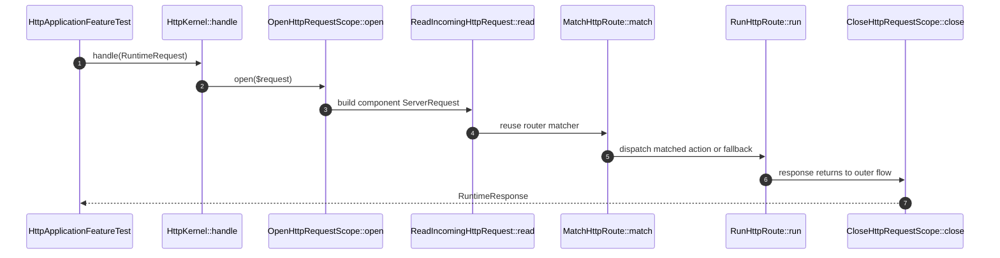

# Handle Incoming Http How This Works

## What this folder is

This folder owns the framework HTTP request lifecycle.

## Real commands or triggers that reach this folder

- `$application->http()->handle(...)`
- `PhpFpmRuntime::handleGlobals(...)`

## Exact upstream handoffs

- `PublicSurface/Http/HttpKernel.php`
- function: `HttpKernel::handle(...)`
- `HttpKernel.php` -> `HandleIncomingHttp::handle(...)`

## The simplest story

- a typed runtime request enters the flow.
- the flow opens request scope and records runtime context.
- route-backed handlers first translate the runtime request into the existing HTTP request component, match one route, and run that route or fallback.
- raw callback handlers still remain valid and are normalized in the same outer flow.
- the scope closes before the response leaves the flow.

## The first important path

When you type:

```bash
vendor/bin/phpunit tests/Feature/Framework/HttpApplicationFeatureTest.php
```

the important path is:



- **Step 1:** the public kernel receives a typed request.
- **Step 2:** the flow opens request scope and records context.
- **Step 3:** route-backed handlers reuse the request and router components through explicit bridge owners.
- **Step 4:** the final PSR response is normalized into `RuntimeResponse`.
- **Step 4:** the scope is closed before returning.

## Direct files in this folder

### HandleIncomingHttp.php

This is the file where the HTTP execution order is owned.

When the story opens this file:

- `HttpKernel::handle(...)` -> `HandleIncomingHttp::handle(...)` -> `HandleIncomingHttp.php`

What arrives here:

- `RuntimeInterface`
- `RuntimeRequest`

What leaves this file:

- `RuntimeResponse`
- recorded runtime result

Why you open it first:

- request scope remains open after an HTTP request
- arrays or strings are normalized into the wrong response type

### ReadIncomingHttpRequest.php

This file turns `RuntimeRequest` into the existing `ServerRequest` component shape.

Open it when:

- request body parsing is wrong
- route actions cannot see query params or request attributes
- the framework bridge starts leaking transport-specific request details

### MatchHttpRoute.php

This file owns the first framework-level route decision.

Open it when:

- dynamic parameters are not injected
- HEAD or 404/405 behavior is wrong
- route matching appears to bypass the reused router capability

### RunHttpRoute.php

This file owns route action execution after one route has already been matched.

Open it when:

- controller or closure dispatch fails after a valid match
- fallback execution behaves differently than normal route execution

### ConfiguredRoutesHttpHandler.php

This file is the route-backed compatibility bridge used by `ApplicationBuilder::withHttpRoutes(...)`
and `ApplicationBuilder::withHttpRouteDefinitions(...)`.

Open it when:

- the existing routes file loads but the framework still behaves like callback-only HTTP
- facade-backed route registration fails during framework boot

## Child folders in this folder

### none

Open the direct files in this folder.

Use it when:

- HTTP flow order changes
- request scope behavior changes

## Debug first

- start in `OpenHttpRequestScope::open(...)` when request-local state never appears
- start in `ReadIncomingHttpRequest::read(...)` when HTTP inputs are missing or malformed
- start in `MatchHttpRoute::match(...)` when route resolution is wrong
- start in `HandleIncomingHttp::normalizeResponse(...)` when payload normalization is wrong

## What to remember

- request scope opens before handler execution.
- route-backed HTTP now has canonical framework owners for request translation, route matching, and route execution.
- request scope closes in the same flow.
- runtime context records the last result.

## Dictionary

<a id="dictionary-runtime-request"></a>

- `runtime request`: framework-owned neutral request object used before component-specific request migration
