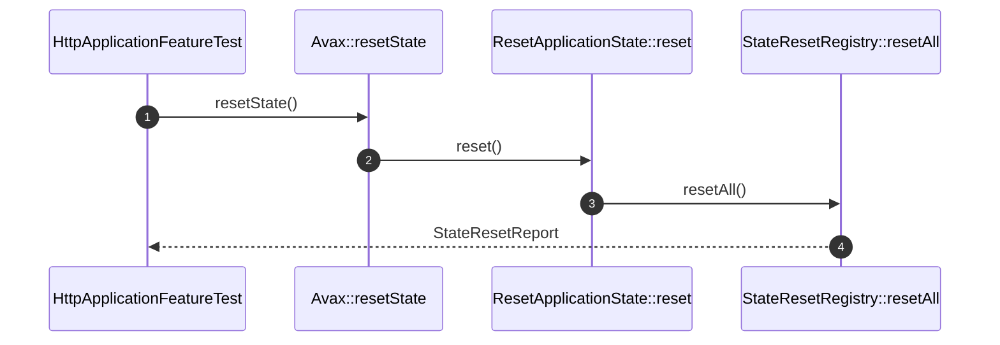

# Reset Application State How This Works

## What this folder is

This folder owns the reset flow that clears framework-held mutable state.

## Real commands or triggers that reach this folder

- `$application->resetState()`
- worker-style runtime teardown after one request

## Exact upstream handoffs

- `PublicSurface/Avax.php`
- function: `Avax::resetState()`
- `Avax.php` -> `ResetApplicationState::reset()`

## The simplest story

- the public facade asks for a reset.
- the flow delegates to the reset registry.
- the registry resets request scopes and runtime context.
- the flow returns a report or throws `StateResetFailed`.

## The first important path

When you type:

```bash
vendor/bin/phpunit tests/Feature/Framework/HttpApplicationFeatureTest.php
```

the important path is:



- **Step 1:** reset starts at the public facade.
- **Step 2:** the flow asks the registry to reset all states.
- **Step 3:** registered states clear themselves.
- **Step 4:** the caller receives a report or failure.

## Direct files in this folder

### ResetApplicationState.php

This is the file where reset success and failure are decided.

When the story opens this file:

- `Avax::resetState()` -> `ResetApplicationState::reset()` -> `ResetApplicationState.php`

What arrives here:

- `StateResetRegistry`
- the need for one explicit reset boundary

What leaves this file:

- `StateResetReport`
- `StateResetFailed`

Why you open it first:

- `lastResult` survives reset
- a reset failure disappears silently

## Child folders in this folder

### none

Open the direct files in this folder.

Use it when:

- request leak cleanup changes
- worker-safe reset behavior changes

## Debug first

- start in `StateResetRegistry::resetAll()` when one state is missing from the report
- start in `ResetRuntimeContext::reset()` when context survives reset

## What to remember

- reset is one explicit flow.
- reports are explicit.
- worker safety depends on this flow staying honest.

## Dictionary

<a id="dictionary-reset-report"></a>

- `reset report`: the explicit outcome of one application state reset cycle
