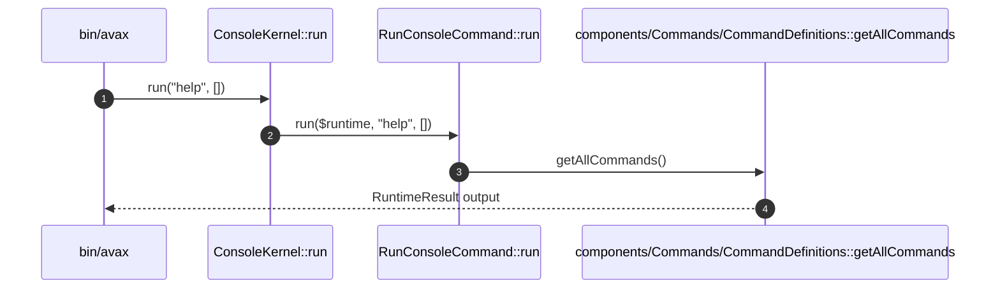

# Run Console Command How This Works

## What this folder is

This folder owns the framework console execution flow.

## Real commands or triggers that reach this folder

- `bin/avax help`
- `$application->console()->run(...)`

## Exact upstream handoffs

- `PublicSurface/Console/ConsoleKernel.php`
- function: `ConsoleKernel::run(...)`
- `ConsoleKernel.php` -> `RunConsoleCommand::run(...)`

## The simplest story

- a command name enters from the public console kernel.
- the flow runs a framework-registered command when present.
- otherwise it reads the existing legacy command catalog for help and explicit compatibility messaging.

## The first important path

When you type:

```bash
bin/avax help
```

the important path is:



- **Step 1:** the public kernel receives the CLI command name.
- **Step 2:** the flow checks framework-registered commands.
- **Step 3:** help output reuses the existing legacy command catalog.
- **Step 4:** stdout receives the rendered result.

## Direct files in this folder

### RunConsoleCommand.php

This is the file where command routing and compatibility messaging are owned.

When the story opens this file:

- `bin/avax` -> `ConsoleKernel::run(...)` -> `RunConsoleCommand.php`

What arrives here:

- command name
- CLI arguments
- runtime command catalog

What leaves this file:

- `RuntimeResult`
- explicit "legacy command not yet wired" messages when needed

Why you open it first:

- `help` omits expected commands
- a framework command returns the wrong exit code

## Child folders in this folder

### none

Open the direct files in this folder.

Use it when:

- command catalog behavior changes
- CLI compatibility messaging changes

## Debug first

- start in `RunConsoleCommand::run(...)` when framework commands are ignored
- start in `components/Commands/CommandDefinitions.php` when help output misses a legacy command

## What to remember

- framework commands win first.
- legacy command metadata is reused for visibility.
- runtime results stay explicit.

## Dictionary

<a id="dictionary-legacy-command-catalog"></a>

- `legacy command catalog`: the existing command metadata from `components/Commands/CommandDefinitions.php`
