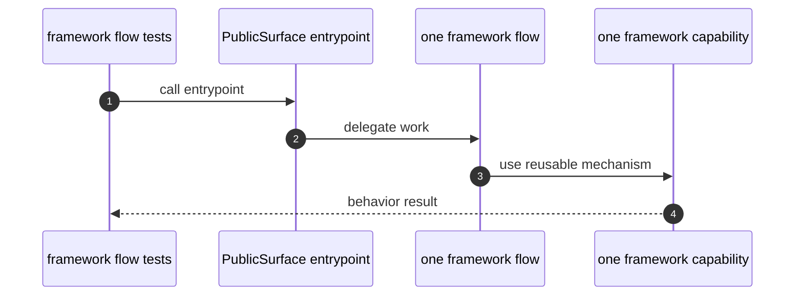

# Flows How This Works

## What this folder is

This folder groups the execution owners for framework behavior.

## Real commands or triggers that reach this folder

- `Avax::boot(...)`
- `$application->http()->handle(...)`
- `bin/avax help`
- `$application->resetState()`

## Exact upstream handoffs

- `PublicSurface/Avax.php`
- function: `Avax::boot(...)`
- `PublicSurface/*` -> `Flows/*`

## The simplest story

- the public surface delegates to one flow owner.
- the flow decides execution order.
- capabilities provide the reusable mechanics the flow needs.

## The first important path

When you type:

```bash
vendor/bin/phpunit tests/Unit/Framework/System/Flows
```

the important path is:



- **Step 1:** a public entrypoint receives an external call.
- **Step 2:** the matching flow takes ownership of execution order.
- **Step 3:** the flow uses one or more capabilities.
- **Step 4:** the caller receives the final result.

## Direct files in this folder

### how-this-works.md

This is the index for framework flow owners.

When the story opens this file:

- `PublicSurface/*` -> `Flows/how-this-works.md`

What arrives here:

- the need to identify which flow owns behavior

What leaves this file:

- the map to boot, HTTP, console, and reset flows

Why you open it first:

- ownership is unclear
- behavior order changed

## Child folders in this folder

### BootApplication/

Open `BootApplication/how-this-works.md`.

Use it when:

- boot changes
- runtime composition changes

### HandleIncomingHttp/

Open `HandleIncomingHttp/how-this-works.md`.

Use it when:

- HTTP lifecycle changes
- request scope behavior changes

### ResetApplicationState/

Open `ResetApplicationState/how-this-works.md`.

Use it when:

- reset behavior changes
- worker safety changes

### RunConsoleCommand/

Open `RunConsoleCommand/how-this-works.md`.

Use it when:

- command behavior changes
- CLI compatibility changes

## Debug first

- start in the public entrypoint and then jump to the matching flow folder
- start in the matching child folder when execution order is the suspected bug

## What to remember

- flows own behavior order.
- capabilities own reusable mechanics.
- public surface delegates.

## Dictionary

<a id="dictionary-flow-owner"></a>

- `flow owner`: the unit that owns execution order for one framework behavior
