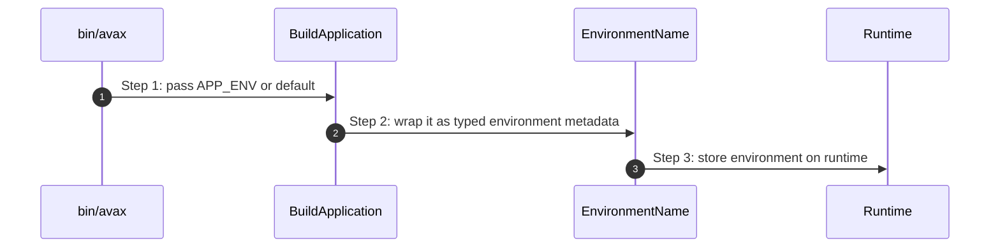

# Environment How This Works

## What this folder is

This folder owns the typed runtime environment name used during boot and diagnostics.

## Real commands or triggers that reach this folder

- `BuildApplication::fromProjectPath(...)`
- `bin/avax`
- any runtime code that inspects the current environment

## Exact upstream handoffs

- `framework/System/Configuration/BuildApplication/BuildApplication.php`
- function: `BuildApplication::fromProjectPath(...)`
- `BuildApplication::fromProjectPath(...)` -> `EnvironmentName`

## The simplest story

- boot receives a raw environment string
- foundation wraps it in one explicit type
- runtime exposes that value consistently

## The first important path

When you type:

```bash
APP_ENV=development php bin/avax ping
```

the important path is:



- **Step 1:** CLI or bootstrap chooses an environment name
- **Step 2:** the environment becomes explicit runtime metadata

## What gets written changed or executed

- one environment value object is created
- no hidden env lookups should happen deeper in the runtime for this concern

## Failure path

- incorrect environment handling should be debugged at the builder input first

## What user sees

- more predictable runtime metadata and diagnostics

## Where to debug first

- `framework/System/Foundation/Environment/EnvironmentName.php`
