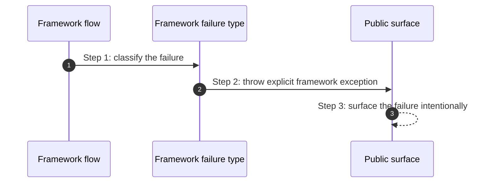

# Failure How This Works

## What this folder is

This folder owns framework-level failure vocabulary.
It keeps lifecycle failures explicit instead of scattering generic exceptions through boot and runtime code.

## Real commands or triggers that reach this folder

- any boot failure
- any framework misconfiguration detected by the new runtime axis

## Exact upstream handoffs

- `framework/System/Flows/BootApplication/BootApplication.php`
- `framework/System/Flows/HandleIncomingHttp/HandleIncomingHttp.php`
- `framework/System/Flows/ResetApplicationState/ResetApplicationState.php`

## The simplest story

- a flow detects framework-specific failure
- it throws a framework failure type with explicit meaning
- the caller can classify the failure without reverse-engineering generic exceptions

## The first important path

When you type:

```bash
php bin/avax missing-command
```

the important path is:



- **Step 1:** flows translate raw errors into framework meaning
- **Step 2:** callers receive one consistent failure vocabulary

## What gets written changed or executed

- failure objects are created
- no recovery policy is hidden here

## Failure path

- this folder is itself the failure path boundary

## What user sees

- clearer boot and configuration errors

## Where to debug first

- `framework/System/Foundation/Failure/FrameworkFailure.php`
- `framework/System/Foundation/Failure/FrameworkBootFailed.php`
- `framework/System/Foundation/Failure/FrameworkMisconfigured.php`
