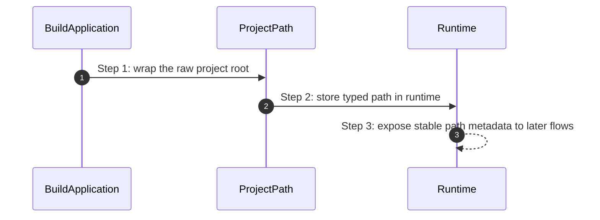

# Paths How This Works

## What this folder is

This folder owns typed filesystem path primitives for framework boot and runtime metadata.

## Real commands or triggers that reach this folder

- `BuildApplication::fromProjectPath(...)`
- any runtime consumer that needs the project or runtime path

## Exact upstream handoffs

- `framework/System/Configuration/BuildApplication/BuildApplication.php`
- function: `BuildApplication::fromProjectPath(...)`
- `BuildApplication::fromProjectPath(...)` -> `ProjectPath`

## The simplest story

- raw path strings are normalized into explicit path objects
- runtime carries those typed paths forward

## The first important path

When you type:

```bash
php bin/avax ping
```

the important path is:



- **Step 1:** the public builder captures the project root
- **Step 2:** path primitives keep filesystem intent explicit

## What gets written changed or executed

- typed path objects are created
- no real IO is executed in this folder

## Failure path

- path mistakes should be traced back to builder input and path normalization

## What user sees

- more predictable boot configuration and fewer path-string ambiguities

## Where to debug first

- `framework/System/Foundation/Paths/ProjectPath.php`
- `framework/System/Foundation/Paths/RuntimePath.php`
