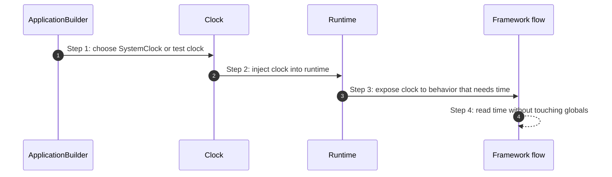

# Time How This Works

## What this folder is

This folder owns framework clock abstractions.
It isolates real time from business and runtime orchestration so tests can prove behavior deterministically.

## Real commands or triggers that reach this folder

- framework boot
- any flow or capability that reads the runtime clock

## Exact upstream handoffs

- `framework/System/Configuration/BuildApplication/ApplicationBuilder.php`
- function: `ApplicationBuilder::__construct(...)`
- `ApplicationBuilder` -> `Runtime`

## The simplest story

- configuration chooses a clock
- runtime stores that clock
- flows read time through the abstraction instead of direct globals

## The first important path

When you type:

```bash
php bin/avax ping
```

the important path is:



- **Step 1:** boot selects the clock implementation
- **Step 2:** runtime receives one stable clock
- **Step 3:** downstream behavior uses the abstraction consistently

## What gets written changed or executed

- one clock implementation is selected
- no wall-clock reads should be hidden outside this boundary

## Failure path

- time-related bugs should be debugged by checking which clock was injected first

## What user sees

- deterministic tests and explicit time control

## Where to debug first

- `framework/System/Foundation/Time/SystemClock.php`
- `framework/System/Foundation/Time/FrozenClock.php`
