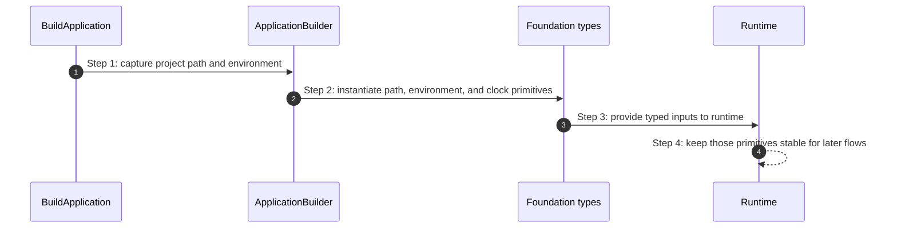

# Foundation How This Works

## What this folder is

This folder owns tiny neutral primitives used by the framework runtime.
It exists to keep basic concepts such as time, paths, environment, and framework failures out of higher-level flows.

## Real commands or triggers that reach this folder

- every framework boot path
- every runtime and flow that needs environment, path, clock, or failure primitives

## Exact upstream handoffs

- `framework/System/Configuration/BuildApplication/ApplicationBuilder.php`
- `framework/System/Capabilities/Runtime/Runtime.php`
- `framework/System/Flows/BootApplication/BuildApplicationState.php`

## The simplest story

- higher-level code depends on small immutable primitives
- foundation types carry meaning without hidden behavior
- flows and capabilities compose those primitives into runtime behavior

## The first important path

When you type:

```bash
php bin/avax ping
```

the important path is:



- **Step 1:** boot starts with raw scalar input
- **Step 2:** foundation wraps scalars in explicit types
- **Step 3:** runtime stores those primitives as stable context

## What gets written changed or executed

- immutable value objects and framework failure types are instantiated
- no request-local state lives here

## Failure path

- invalid primitive input should fail early and explicitly
- framework-wide failure types provide a common error vocabulary

## What user sees

- users do not call these classes directly in normal flows
- they benefit from clearer errors and typed runtime metadata

## Where to debug first

- start in the specific subfolder that owns the primitive being used: `Time`, `Paths`, `Environment`, or `Failure`

## Which terms are easy to confuse here

- `Foundation` is not a helpers bucket
- `Capabilities` own reusable mechanisms
- `Foundation` owns only tiny neutral building blocks
