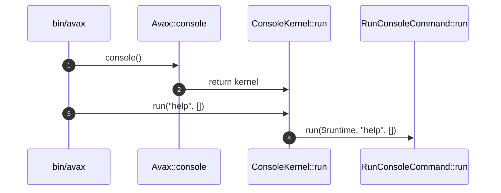

# Console Public Surface How This Works

## What this folder is

This folder owns the stable console public entrypoint for the new framework slice.

## Real commands or triggers that reach this folder

- `bin/avax help`
- `$application->console()->run(...)`

## Exact upstream handoffs

- `PublicSurface/Avax.php`
- function: `Avax::console()`
- `Avax.php` -> `Console/ConsoleKernel.php`

## The simplest story

- `Avax` exposes the console kernel.
- `ConsoleKernel` delegates to `RunConsoleCommand`.
- the caller receives `RuntimeResult`.

## The first important path

When you type:

```bash
bin/avax help
```

the important path is:



- **Step 1:** the CLI script asks for the console kernel.
- **Step 2:** the caller passes the command name.
- **Step 3:** the kernel delegates to the console flow.
- **Step 4:** the flow returns a typed runtime result.

## Direct files in this folder

### ConsoleKernel.php

This is the file where the stable console public entrypoint delegates to the flow.

When the story opens this file:

- `bin/avax` -> `Avax::console()` -> `ConsoleKernel.php`

What arrives here:

- command name
- arguments
- the assembled framework runtime

What leaves this file:

- `RuntimeResult`

Why you open it first:

- CLI output is wrong
- the wrong command flow gets called

## Child folders in this folder

### none

Open the direct files in this folder.

Use it when:

- console public API changes
- CLI entry delegation changes

## Debug first

- start in `ConsoleKernel::run(...)` when the wrong flow is called
- start in `RunConsoleCommand::run(...)` when command resolution is wrong

## What to remember

- this folder is the stable console doorway.
- command behavior lives in the flow.
- legacy command metadata is reused downstream, not stored here.

## Dictionary

<a id="dictionary-console-kernel"></a>

- `console kernel`: the stable framework CLI entrypoint
