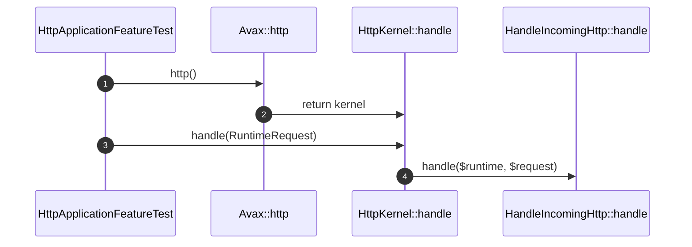

# Http Public Surface How This Works

## What this folder is

This folder owns the stable HTTP public entrypoint for the new framework slice.

## Real commands or triggers that reach this folder

- `$application->http()->handle(...)`
- `PhpFpmRuntime::handle(...)`

## Exact upstream handoffs

- `PublicSurface/Avax.php`
- function: `Avax::http()`
- `Avax.php` -> `Http/HttpKernel.php`

## The simplest story

- the caller asks `Avax` for the HTTP kernel.
- `HttpKernel` delegates into `HandleIncomingHttp`.
- the caller receives `RuntimeResponse`.

## The first important path

When you type:

```bash
vendor/bin/phpunit tests/Feature/Framework/HttpApplicationFeatureTest.php
```

the important path is:



- **Step 1:** the application exposes the HTTP kernel.
- **Step 2:** the caller sends a typed request.
- **Step 3:** the kernel delegates to the HTTP flow.
- **Step 4:** the caller gets a typed runtime response.

## Direct files in this folder

### HttpKernel.php

This is the file where the stable HTTP public entrypoint delegates to the flow.

When the story opens this file:

- `Avax::http()` -> `HttpKernel::handle(...)` -> `HttpKernel.php`

What arrives here:

- `RuntimeRequest`
- the assembled framework runtime

What leaves this file:

- `RuntimeResponse`

Why you open it first:

- the HTTP public contract changes
- HTTP behavior diverges from the flow you expected

## Child folders in this folder

### none

Open the direct files in this folder.

Use it when:

- HTTP public API changes
- HTTP entry delegation changes

## Debug first

- start in `HttpKernel::handle(...)` when the wrong flow is called
- start in `HandleIncomingHttp::handle(...)` when the flow itself is wrong

## What to remember

- this folder is the stable HTTP doorway.
- behavior lives in the flow.
- request state does not live here.

## Dictionary

<a id="dictionary-http-kernel"></a>

- `http kernel`: the stable framework HTTP entrypoint
