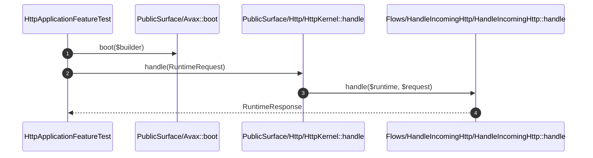

# Public Surface How This Works

## What this folder is

This folder is the stable framework API boundary. It receives external calls and delegates them into internal flows.

## Real commands or triggers that reach this folder

- `bin/avax help`
- `Avax::boot(...)`
- `$application->http()->handle(...)`

## Exact upstream handoffs

- `bin/avax`
- function: `Avax::boot(...)`
- `PublicSurface/Avax.php` -> `PublicSurface/Http/HttpKernel.php`

## The simplest story

- `Avax` boots the runtime.
- `HttpKernel` delegates HTTP work into `HandleIncomingHttp`.
- `ConsoleKernel` delegates CLI work into `RunConsoleCommand`.

## The first important path

When you type:

```bash
vendor/bin/phpunit tests/Feature/Framework/HttpApplicationFeatureTest.php
```

the important path is:



- **Step 1:** the public surface receives a boot call.
- **Step 2:** the public kernel receives the typed request.
- **Step 3:** the flow runs the lifecycle work.
- **Step 4:** the caller receives a framework response object.

## Direct files in this folder

### Avax.php

This is the stable root facade for the framework slice.

When the story opens this file:

- `bin/avax` -> `Avax::boot(...)` -> `Avax.php`

What arrives here:

- `ApplicationBuilder`
- the need for a stable API boundary

What leaves this file:

- a booted runtime-backed facade
- `HttpKernel`
- `ConsoleKernel`

Why you open it first:

- the application never reaches boot
- a public method starts doing real internal work

## Child folders in this folder

### Http/

Open `Http/how-this-works.md`.

Use it when:

- HTTP entry behavior changes
- request scope bugs show up only in HTTP tests

### Console/

Open `Console/how-this-works.md`.

Use it when:

- `bin/avax` output is wrong
- command dispatch changes

## Debug first

- start in `Avax::boot(...)` when none of the public APIs are available
- start in `HttpKernel::handle(...)` when a request returns the wrong framework response

## What to remember

- `PublicSurface/` is the doorway.
- it delegates into flows.
- request state does not live here.

## Dictionary

<a id="dictionary-public-surface"></a>

- `public surface`: the stable external API boundary of the framework
