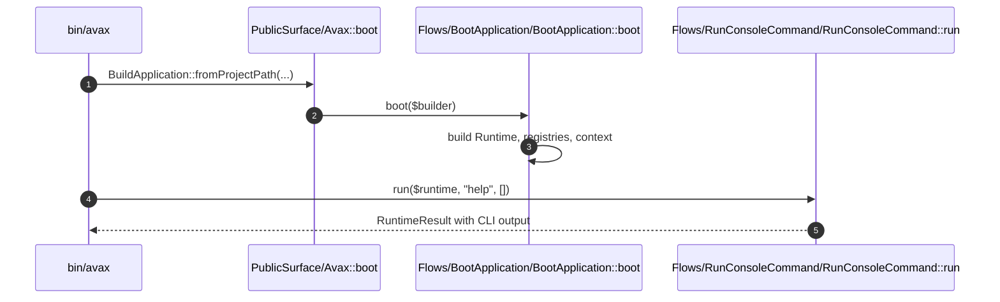

# Framework System How This Works

## What this folder is

This folder owns the new framework lifecycle axis for Avax. It boots the application, exposes the stable public
surface, runs HTTP and console flows, and resets request-local state.

## Real commands or triggers that reach this folder

- `vendor/bin/phpunit tests/Feature/Framework`
- `bin/avax help`
- `Avax::boot(...)`

## Exact upstream handoffs

- `framework/System/PublicSurface/Avax.php`
- function: `Avax::boot(...)`
- `PublicSurface/Avax.php` -> `Flows/BootApplication/BootApplication::boot(...)`

## The simplest story

- `ApplicationBuilder` enters from `BuildApplication::fromProjectPath(...)`.
- `BootApplication` builds runtime state, request scope storage, reset registry, and component registry.
- `Avax` exposes `http()`, `console()`, and `resetState()` as the small external boundary.

## The first important path

When you type:

```bash
bin/avax help
```

the important path is:



- **Step 1:** `bin/avax` boots the framework public surface.
- **Step 2:** `BootApplication` creates the runtime graph.
- **Step 3:** `RunConsoleCommand` resolves framework or legacy-catalog commands.
- **Step 4:** the user sees CLI output on stdout.

## Direct files in this folder

### how-this-works.md

This is the root explanation for the framework runtime slice.

When the story opens this file:

- `bin/avax help` -> `PublicSurface/Avax::boot(...)` -> `docs/framework/System/how-this-works.md`

What arrives here:

- a new reader
- the need to understand who owns lifecycle now

What leaves this file:

- the runtime ownership story
- the first debug path
- the public entrypoints

Why you open it first:

- boot succeeds but request state behaves strangely
- you need to know whether a behavior belongs to framework or component code

## Child folders in this folder

### PublicSurface/

Open `PublicSurface/how-this-works.md`.

Use it when:

- `Avax::boot(...)` is the first API you touch
- you need the stable external entrypoint contract

### Capabilities/

Open `Capabilities/Runtime/how-this-works.md`.

Use it when:

- request scope leaks across requests
- you need to inspect runtime state holders

### Flows/

Open `Flows/BootApplication/how-this-works.md`.

Use it when:

- boot logic changes
- HTTP or console flow order changes

## Debug first

- start in `PublicSurface/Avax::boot(...)` when the framework does not boot
- start in `Flows/HandleIncomingHttp/HandleIncomingHttp::handle(...)` when HTTP behavior differs from CLI behavior

## What to remember

- `framework/System` now owns lifecycle.
- request-local state lives in explicit framework capabilities.
- public entrypoints delegate instead of doing the work inline.

## Dictionary

<a id="dictionary-runtime"></a>

- `runtime`: the assembled framework state and entrypoint graph for one application instance
