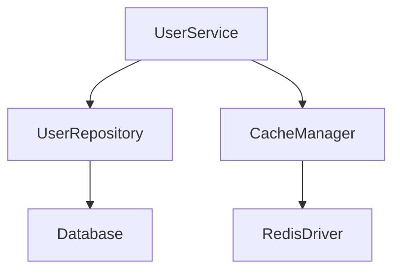

# 🧊 AvaX Future-Proof Master Plan

> AvaX is a runtime-agnostic, architecture-first PHP framework built for secure, scalable, high-performance applications.
> It includes system-design-grade tooling for runtime safety, architecture validation, observability, configuration integrity, and component boundary enforcement.

---

## Identitet

```text
modern PHP runtime framework
worker-safe
observable
async-ready
strong DX
strict boundaries
```

AvaX **nije** Laravel klon. AvaX je framework sa **ugrađenom system-design inteligencijom**.

---

## 1. Runtime Safety Features

Najvažniji feature za FrankenPHP, RoadRunner, Swoole, Workerman ciljeve. Core-level killer feature.

```text
components/RuntimeSafety/
  System/
    PublicSurface/
      RuntimeSafety.php

    Flows/
      DetectStateLeak/
      VerifyRequestScopeWasClosed/
      VerifyResetWasExecuted/
      InspectStaticState/

    Capabilities/
      StateLeakDetection/
      StaticStateScanner/
      ResetVerification/
      ScopedBindingAudit/
```

**Feature-i:**
- State leak detector
- Request scope leak detector
- Static facade state detector
- Singleton safety audit
- Reset hook verification
- Long-lived worker readiness report

**DX:**

```bash
php avax runtime:doctor
```

```text
✔ request scope closes correctly
✔ state reset is registered
✘ Cache facade keeps mutable static state without reset hook
✘ SessionStore is singleton but stores request-local data
```

**Killer feature ideja:**

```bash
php avax runtime:doctor --worker
```

```text
Can this app safely run for 10,000 requests in the same PHP process?
```

Proverava:
- request scope
- state reset
- static facade state
- unsafe singleton services
- runtime adapter leaks
- open resources
- unclosed transactions
- diagnostic context leaks

---

## 2. Runtime Doctor / Framework Health Check

Pravi health diagnosis, ne "debug dump".

```text
components/Diagnostics/
  System/
    Flows/
      DiagnoseApplication/
      DiagnoseRuntime/
      DiagnoseConfiguration/
      DiagnoseContainer/
      DiagnoseRoutes/
```

**Komande:**

```bash
php avax doctor
php avax doctor:runtime
php avax doctor:container
php avax doctor:routes
php avax doctor:config
```

**Šta proverava:**
- missing providers
- duplicate bindings
- unsafe singleton bindings
- unreachable routes
- route conflicts
- missing env values
- invalid config shape
- runtime adapter mismatch
- request-scope violations
- state reset violations

Ne samo "radi/ne radi", nego **"zašto ne radi"**.

---

## 3. Execution Timeline / Request Trace

Framework mora da zna šta se desilo od ulaza do izlaza.

```text
components/Tracing/
  System/
    PublicSurface/
      Tracing.php

    Flows/
      StartTrace/
      RecordTraceEvent/
      FinishTrace/
      ExportTrace/

    Capabilities/
      Timeline/
      Spans/
      Exporters/
```

**Primer:**

```text
request.received         0.00ms
container.scope.opened   0.12ms
route.matched            0.83ms
middleware.executed      1.31ms
controller.executed      5.91ms
response.sent            6.20ms
state.reset              6.40ms
```

Interno koristi: `RuntimeTimeline`, `RuntimeEvent`, `TraceId`, `CorrelationId`.
Kasnije može OpenTelemetry exporter, ali prvo interni tracing model.

---

## 4. Container Intelligence

Ne samo DI, nego **"explainable DI"**.

**Komande:**

```bash
php avax container:graph
php avax container:why App\Service\UserService
php avax container:inspect UserRepository
php avax container:unused
php avax container:cycles
php avax container:scope-audit
```

**Killer feature:**

```text
Explain why this service exists, how it is built, which scope owns it, and whether it is worker-safe.
```

---

## 5. Route Intelligence

Ne samo route list.

```text
components/Router/
  System/
    Flows/
      ExplainRouteMatch/
      DetectRouteConflict/
      GenerateRouteMap/
      ValidateRouteDefinitions/
```

**Komande:**

```bash
php avax routes
php avax routes:explain GET /users/15
php avax routes:conflicts
php avax routes:middleware
```

**Output:**

```text
GET /users/{id}
matched by: UserRoutes.php:12
constraints: id = numeric
middleware: auth, throttle
controller: ShowUser
```

---

## 6. Configuration Schema Validation

Svaka komponenta mora imati config schema.

```php
CacheConfiguration::schema()
DatabaseConfiguration::schema()
RuntimeConfiguration::schema()
```

**Feature-i:**
- typed config
- config validation
- missing env detection
- config source trace
- config override explanation

**Komande:**

```bash
php avax config:validate
php avax config:explain cache.default
php avax config:sources
php avax config:dump --safe
```

**Primer:**

```text
cache.default = redis
source: config/cache.php
overridden by: CACHE_DRIVER env
validated as: non-empty string
```

---

## 7. First-Class Feature Flags

```text
components/FeatureFlags/
  System/
    PublicSurface/
      FeatureFlags.php

    Flows/
      CheckFeatureFlag/
      EnableFeatureFlag/
      DisableFeatureFlag/
      ResolveFeatureVariant/

    Capabilities/
      Flags/
      Variants/
      Stores/
      Targeting/
```

**API:**

```php
FeatureFlags::enabled('new-checkout')
FeatureFlags::variant('search-ranking')
```

> V1/V2, ne V0.

---

## 8. Resilience Component

```text
components/Resilience/
  System/
    PublicSurface/
      Resilience.php

    Flows/
      RetryOperation/
      BreakCircuit/
      LimitRate/
      ApplyTimeout/
      ApplyBulkhead/

    Capabilities/
      Retry/
      CircuitBreaker/
      RateLimiter/
      Timeout/
      Backoff/
```

**Feature-i:** retry with backoff, timeout, circuit breaker, rate limiter, bulkhead isolation.

**API:**

```php
Resilience::retry()
    ->times(3)
    ->backoff(milliseconds: 200)
    ->run(fn () => $client->send($request));
```

---

## 9. Async / Concurrency Abstraction

Ne pun async sada. Ali projektovana capability.

```text
components/Concurrency/
  System/
    PublicSurface/
      Concurrency.php

    Flows/
      RunConcurrentTasks/
      AwaitTask/
      CancelTask/
      RaceTasks/

    Capabilities/
      Tasks/
      Fibers/
      Cancellation/
      Timeouts/
      EventLoop/
      Adapters/
```

**API:**

```php
[$user, $orders, $stats] = Concurrency::all([
    fn () => $users->find($id),
    fn () => $orders->forUser($id),
    fn () => $stats->forUser($id),
]);
```

> `Concurrency` ne sme da procuri svuda. To je capability, ne globalna infekcija.

---

## 10. Streaming Responses / SSE

```text
components/Response/System/Capabilities/Streaming/
  StreamingResponse.php
  ServerSentEvents.php
  StreamEmitter.php
```

**API:**

```php
return Response::stream(function () {
    yield 'chunk 1';
    yield 'chunk 2';
});

return Response::sse(function () {
    yield Event::make('progress', ['value' => 10]);
});
```

---

## 11. WebSocket / Realtime Component

Ime: `Realtime`, ne `WebSocket` — pokriva WebSocket, SSE, broadcasting, presence, live events.

```text
components/Realtime/
  System/
    PublicSurface/
      Realtime.php

    Flows/
      AcceptConnection/
      AuthenticateConnection/
      SubscribeToChannel/
      BroadcastMessage/
      CloseConnection/

    Capabilities/
      Connections/
      Channels/
      Broadcasting/
      Presence/
      Protocols/
```

---

## 12. Tasks (ne Jobs, ne Queue)

`Tasks` je šire i neutralnije. `Queue` je implementation detail. `Job` je Laravel-ish.

```text
components/Tasks/
  System/
    PublicSurface/
      Tasks.php

    Flows/
      DispatchTask/
      RunTask/
      RetryFailedTask/
      ScheduleTask/
      CancelTask/

    Capabilities/
      TaskBus/
      TaskQueue/
      TaskResult/
      Retries/
      Backoff/
      FailedTasks/
      Batches/
```

**API:**

```php
Tasks::dispatch(SendWelcomeEmail::for($userId));
Tasks::later(SyncReport::make(), delay: '10 minutes');
Tasks::batch([...])->dispatch();
```

---

## 13. Scheduler

Prirodan par uz Tasks.

```text
components/Scheduler/
  System/
    PublicSurface/
      Scheduler.php

    Flows/
      RegisterScheduledTask/
      RunDueTasks/
      SkipOverlappingTask/
      RecordTaskRun/

    Capabilities/
      Cron/
      Locks/
      TaskHistory/
```

**Feature-i:** cron expressions, without overlapping, on one server, run in background, task history, failure reporting.

---

## 14. Security Hardening Component

Ne samo Auth. Security kao framework capability.

```text
components/Security/
  System/
    PublicSurface/
      Security.php

    Flows/
      VerifyCsrfToken/
      ApplySecurityHeaders/
      EnforceTrustedHosts/
      EnforceTrustedProxies/
      ValidateSignedUrl/

    Capabilities/
      Csrf/
      Headers/
      TrustedProxy/
      SignedUrls/
      RateLimiting/
```

**Feature-i:** CSRF, signed URLs, security headers, trusted proxy, trusted host, rate limiting, password hashing policies, secret redaction.

---

## 15. Secrets / Vault / Sensitive Config

```text
components/Secrets/
  System/
    PublicSurface/
      Secrets.php

    Flows/
      ReadSecret/
      RotateSecret/
      RedactSecret/

    Capabilities/
      Stores/
      Redaction/
      Encryption/
```

**Komanda:**

```bash
php avax config:dump --safe
```

Ne sme ispisati DB password, API keys, tokens.

---

## 16. Test Doubles / Fakes

```text
components/Testing/
  System/
    PublicSurface/
      Testing.php

    Capabilities/
      Fakes/
        EventFake.php
        CacheFake.php
        HttpFake.php
        MailFake.php      # later
        TaskFake.php      # later
```

Samo za postojeće komponente. Ne vraćati fake-ove za komponente koje još ne postoje.

---

## 17. Package / Module Manifest

Svaka komponenta ima `component.php`:

```php
return Component::make('cache')
    ->provides(Cache::class)
    ->provider(CacheProvider::class)
    ->config('cache')
    ->resettable(ResetCacheState::class)
    ->dependsOn(Config::class);
```

**Komande:**

```bash
php avax components
php avax components:graph
php avax components:doctor
```

---

## 18. Static Architecture Guard

```text
tooling/architecture/
  check-forbidden-folders.php
  check-public-surface.php
  check-runtime-leaks.php
  check-namespace-drift.php
  check-duplicate-owners.php
  check-docs-mirror.php
```

**Komanda:**

```bash
php avax architecture:check
```

**Proverava:**
- no Core/Shared/Helpers dumping ground
- no DataLayer real files
- no DataFoundation real files
- no `components\` namespace
- no Swoole imports outside Runtime adapters
- no business logic in PublicSurface

---

## 19. Database Safety & Query Governance

```bash
php avax db:doctor
php avax db:slow-queries
php avax db:transactions:audit
php avax db:schema:diff
```

**Feature-i:**
- SQL binding enforcement
- forbidden raw SQL policy
- query timeline
- slow query detection
- N+1 detection
- transaction leak detection
- retry policy for deadlocks
- savepoint strategy
- migration safety checks
- schema drift detection

> No addslashes SQL. No manual string SQL construction for user values. Bindings or fail.

---

## 20. Developer Server

```bash
php avax serve
php avax serve --runtime=fpm
php avax serve --runtime=worker
```

**Feature-i:** route reload, config reload, pretty errors in local env, request timeline, logs.

---

## 📋 Fazni Plan

### V0 — Core Usefulness (System-Design-Grade Foundation)

```text
1. architecture:check tooling
2. runtime:doctor
3. request-scope leak detector
4. config validation/explain
5. route explain/conflict detection
6. container graph/why/scope-audit
7. tracing timeline
8. definitivan runtime contract
9. završen component-suite migration (jedan canonical namespace)
10. duplicate owner guard
11. PublicSurface checker
12. worker safety tests
13. golden path test app
```

### V1 — Developer Power

```text
1. Data collections restored cleanly
2. Persistence UnitOfWork / IdentityMap / Repository
3. Testing fakes for Event/Cache/HTTP
4. Console UI: table, progress bar, questions
5. Security defaults (CSRF, headers, trusted proxy)
6. Config schema system
7. Container intelligence (why/scope-audit/cycles)
8. Route intelligence (explain/conflicts)
9. Database safety enforcement
10. Observability timeline
11. Compiled config/routes/container
12. Docs/test mirror validation
```

### V2 — Modern Runtime Power

```text
1. Resilience component (retry, circuit breaker, timeout, backoff)
2. Concurrency component (Fibers, tasks)
3. Streaming/SSE
4. Tasks (dispatch, retry, batch)
5. Scheduler
6. Realtime/WebSocket
7. Feature Flags
8. Secrets/Vault
```

### V3 — Batteries Included

```text
1. Mail
2. Notifications
3. I18N
4. View engine adapters
5. Debug UI
6. OpenTelemetry exporter
7. Multi-runtime benchmark suite
```

---

## ⛔ Šta NE implementirati sada

```text
Mail
Notifications
Full queue system
Full websocket system
Full Blade clone
Carbon clone
Full ORM magic
I18N
Admin panel
```

To su ogromne rupe za vreme. Na roadmap-u: da. Sada: ne.

---

---

# 💪 System-Design Mišići — Šta bi AvaX učinilo brutalno moćnim

> Ovo su feature-i koje **nijedan PHP framework** trenutno nema kao first-class capability.
> Svaki od njih je system-design patern pretočen u framework primitiv.

---

## 21. Multi-Runtime Abstraction Layer

AvaX mora da radi identično na FPM, RoadRunner, Swoole, FrankenPHP, Workerman — bez da ijedna komponenta zna na čemu trči.

```text
components/Runtime/
  System/
    PublicSurface/
      Runtime.php

    Flows/
      BootRuntime/
      HandleRequest/
      ShutdownGracefully/
      ResetRequestState/

    Capabilities/
      Adapters/
        FpmAdapter.php
        RoadRunnerAdapter.php
        SwooleAdapter.php
        FrankenPhpAdapter.php
      Lifecycle/
        RequestLifecycle.php
        WorkerLifecycle.php
        GracefulShutdown.php
      Detection/
        DetectRuntime.php
```

**Ključna stvar:** Runtime adapter ne sme da "procuri" u bilo koju drugu komponentu. Niko van `Runtime/` ne sme da zna da li trči na Swoole ili FPM. To je **granica koja se čuva architecture guard-om**.

**Komanda:**

```bash
php avax runtime:detect
php avax runtime:benchmark --adapter=roadrunner --requests=10000
```

---

## 22. Health Check Protocol (Kubernetes-Ready)

Svaki moderan deployment koristi readiness i liveness probes. AvaX mora ovo imati ugrađeno.

```text
components/HealthCheck/
  System/
    PublicSurface/
      HealthCheck.php

    Flows/
      CheckLiveness/
      CheckReadiness/
      CheckDependencies/
      ReportHealth/

    Capabilities/
      Checks/
        DatabaseCheck.php
        CacheCheck.php
        FilesystemCheck.php
        QueueCheck.php
        CustomCheck.php
      Report/
        HealthReport.php
        DependencyStatus.php
```

**Endpoints:**

```text
GET /health/live     → 200 OK (proces živi)
GET /health/ready    → 200 OK (sve dependency-ji rade)
GET /health/detail   → JSON sa statusom svake zavisnosti
```

**Primer response:**

```json
{
  "status": "degraded",
  "checks": {
    "database": { "status": "up", "latency_ms": 2.3 },
    "cache": { "status": "up", "latency_ms": 0.4 },
    "filesystem": { "status": "up" },
    "queue": { "status": "down", "error": "connection refused" }
  },
  "runtime": "roadrunner",
  "uptime_seconds": 84200,
  "requests_served": 142389
}
```

> Ovo je must za cloud deployment. Bez ovoga, Kubernetes ne zna da li tvoj pod treba restartovati.

---

## 23. Backpressure Management

Kad sistem prima više nego što može da obradi — mora da kaže "stani", ne da padne.

```text
components/Backpressure/
  System/
    PublicSurface/
      Backpressure.php

    Flows/
      MeasureLoad/
      ApplyBackpressure/
      RejectOverflow/
      ReportPressure/

    Capabilities/
      LoadMeter/
        ActiveRequestCounter.php
        MemoryPressureDetector.php
        QueueDepthMonitor.php
      Policies/
        RejectPolicy.php
        ThrottlePolicy.php
        ShedPolicy.php (load shedding)
      Signals/
        PressureSignal.php
```

**API:**

```php
// Middleware koji automatski odbija kad je load prevelik
Backpressure::guard(maxConcurrent: 100, strategy: 'reject-503');
```

**Zašto je ovo moćno:** Nijedan PHP framework nema first-class backpressure. Svi padnu pod opterećenjem. AvaX bi bio prvi koji kaže: "Znam koliko mogu, i neću umreti pokušavajući više."

---

## 24. Distributed Locking

Za koordinaciju između procesa i servera.

```text
components/Locking/
  System/
    PublicSurface/
      Lock.php

    Flows/
      AcquireLock/
      ReleaseLock/
      ExtendLock/
      WaitForLock/

    Capabilities/
      Stores/
        RedisLockStore.php
        DatabaseLockStore.php
        FileLockStore.php
      Strategies/
        SpinLock.php
        BlockingLock.php
      Safety/
        LockTimeout.php
        DeadlockDetection.php
        FencingToken.php
```

**API:**

```php
Lock::acquire('deploy-migration', ttl: 30, owner: $workerId)
    ->then(fn () => $migrator->run())
    ->finally(fn () => Lock::release('deploy-migration'));
```

**Fencing Token** je ključan: sprečava da stari holder uradi nešto posle isteka locka. Ovo je ozbiljan system-design patern koji skoro niko ne implementira pravilno.

---

## 25. Idempotency Keys

Za API safety — klijent može da pošalje isti zahtev dva puta, a server ga obradi samo jednom.

```text
components/Idempotency/
  System/
    PublicSurface/
      Idempotency.php

    Flows/
      CheckIdempotencyKey/
      StoreIdempotencyResult/
      ReplayIdempotentResponse/

    Capabilities/
      Keys/
        IdempotencyKey.php
        KeyStore.php
      Replay/
        StoredResponse.php
```

**API:**

```php
// Middleware
Idempotency::protect(ttl: '24 hours');
```

**Kako radi:**
1. Request dolazi sa `Idempotency-Key: abc-123` header-om
2. Framework proveri da li je key već viđen
3. Ako jeste → vrati sačuvani response (ne izvršava ponovo)
4. Ako nije → izvrši, sačuvaj response, vrati

> Stripe, AWS, svaki ozbiljan API ovo koristi. AvaX bi ga imao ugrađeno.

---

## 26. Policy Engine (Beyond RBAC)

Auth ima RBAC. Ali moderni sistemi trebaju **Policy-Based Access Control** (PBAC/ABAC).

```text
components/Policy/
  System/
    PublicSurface/
      Policy.php

    Flows/
      EvaluatePolicy/
      ExplainDecision/
      AuditAccess/

    Capabilities/
      Rules/
        PolicyRule.php
        AttributeCondition.php
        TimeCondition.php
        ContextCondition.php
      Engine/
        PolicyEvaluator.php
        PolicyDecision.php  (allow/deny/abstain)
        DecisionExplanation.php
      Audit/
        AccessLog.php
```

**API:**

```php
Policy::allows('publish', $article, context: ['ip' => $request->ip()])
    ->because('author owns article AND is within business hours AND ip is trusted');
```

**Killer feature: `ExplainDecision`** — ne samo "da/ne", nego **zašto**.

```bash
php avax policy:explain "Can user:42 publish article:99?"
```

```text
DENY
reason: user:42 has role:editor
        article:99 requires role:admin for status:draft
        time: outside business hours (policy: publish-window)
```

---

## 27. Audit Trail / Compliance Log

Enterprise sistemi zahtevaju trag svake promene. Ne log fajl — strukturiran, queryable audit trail.

```text
components/AuditTrail/
  System/
    PublicSurface/
      AuditTrail.php

    Flows/
      RecordAuditEvent/
      QueryAuditTrail/
      ExportAuditLog/
      PurgeExpiredRecords/

    Capabilities/
      Events/
        AuditEvent.php
        AuditActor.php
        AuditResource.php
        AuditDiff.php
      Storage/
        AuditStore.php
      Retention/
        RetentionPolicy.php
```

**API:**

```php
AuditTrail::record(
    actor: $currentUser,
    action: 'updated',
    resource: $invoice,
    diff: ['status' => ['draft', 'published']],
    reason: 'Monthly close process'
);
```

> Ovo je must za fintech, healthcare, enterprise SaaS. Ne može se naknadno dodati — mora biti first-class.

---

## 28. Memory Budget & Resource Limits

Framework koji zna koliko memorije troši i može da reaguje pre nego što crash-uje.

```text
components/ResourceGovernor/
  System/
    PublicSurface/
      ResourceGovernor.php

    Flows/
      TrackMemoryUsage/
      EnforceMemoryBudget/
      DetectMemoryLeak/
      ReportResourceUsage/

    Capabilities/
      Memory/
        MemoryBudget.php
        MemorySnapshot.php
        LeakDetector.php
      Limits/
        RequestMemoryLimit.php
        WorkerMemoryLimit.php
        QueryMemoryLimit.php
```

**API:**

```php
ResourceGovernor::budget(memory: '128M', perRequest: '32M');
```

**Worker mode:**

```text
Worker memory: 84MB / 256MB budget
Trend: +0.2MB per 100 requests (possible leak)
Action: restart worker after 10000 requests
```

> Ovo je kritično za long-lived workere. Bez ovoga, worker polako raste dok ne umre.

---

## 29. Contract Testing Between Components

Komponente moraju da testiraju **granice** između sebe, ne samo internu logiku.

```text
components/ContractTesting/
  System/
    PublicSurface/
      ContractTest.php

    Capabilities/
      Contracts/
        PublicSurfaceContract.php
        EventContract.php
        ConfigContract.php
      Verification/
        ContractVerifier.php
        BreakingChangeDetector.php
```

**Komanda:**

```bash
php avax contracts:verify
php avax contracts:breaking-changes --since=v1.0
```

**Output:**

```text
✔ Session::PublicSurface — contract satisfied
✔ Cache::EventContract — emits expected events
✘ Database::PublicSurface — method `rawQuery()` removed (BREAKING)
```

---

## 30. Service Discovery & Dependency Graph

Framework mora da zna koji servisi postoje i kako su povezani — u runtime-u.

```text
components/ServiceMap/
  System/
    PublicSurface/
      ServiceMap.php

    Flows/
      BuildServiceGraph/
      DetectCircularDependency/
      FindOrphanedServices/
      ExplainDependencyChain/

    Capabilities/
      Graph/
        ServiceNode.php
        DependencyEdge.php
        GraphRenderer.php (Mermaid, DOT)
```

**Komanda:**

```bash
php avax services:graph --format=mermaid
php avax services:orphans
php avax services:chain UserService
```

**Output:**



---

## 31. Graceful Degradation / Fallback System

Kad dependency padne, framework ne sme da padne sa njom.

```text
components/Fallback/
  System/
    PublicSurface/
      Fallback.php

    Flows/
      DetectDegradation/
      ActivateFallback/
      ReportDegradedState/

    Capabilities/
      Strategies/
        CacheFallback.php    # kad Redis padne → in-memory
        DatabaseFallback.php # kad DB padne → readonly mode
        QueueFallback.php    # kad queue padne → sync dispatch
      Detection/
        DependencyHealthMonitor.php
```

**API:**

```php
Fallback::for(Cache::class)
    ->when('connection_refused')
    ->use(InMemoryCache::class)
    ->alert('Cache degraded to in-memory');
```

---

## 32. Multi-Tenancy as Framework Primitive

Ne samo DB routing. Kompletna izolacija: config, cache, storage, routes, events.

```text
components/Tenancy/
  System/
    PublicSurface/
      Tenancy.php

    Flows/
      ResolveTenant/
      SwitchTenantContext/
      IsolateTenantState/

    Capabilities/
      Resolution/
        DomainResolver.php
        HeaderResolver.php
        PathResolver.php
      Isolation/
        TenantConfig.php
        TenantCache.php
        TenantStorage.php
        TenantDatabase.php
      Context/
        TenantContext.php  (request-scoped, worker-safe)
```

**API:**

```php
Tenancy::resolve($request); // "acme-corp"
Tenancy::run('acme-corp', fn () => $service->doWork());
```

> Multi-tenancy mora biti **request-scoped** i **worker-safe**. Ako tenant context curi, imaš data leak između klijenata. `runtime:doctor` mora ovo da proverava.

---

## 33. API Versioning as First-Class

```text
components/ApiVersioning/
  System/
    PublicSurface/
      ApiVersion.php

    Flows/
      ResolveApiVersion/
      NegotiateVersion/
      DeprecateVersion/

    Capabilities/
      Resolution/
        HeaderVersionResolver.php    # Accept: application/vnd.avax.v2+json
        PathVersionResolver.php      # /api/v2/users
        QueryVersionResolver.php     # ?version=2
      Lifecycle/
        VersionRegistry.php
        DeprecationPolicy.php
        SunsetHeader.php
```

**Response headers:**

```text
API-Version: 2
Deprecation: true
Sunset: 2026-12-01
Link: <https://docs.example.com/migration>; rel="deprecation"
```

---

## 34. Content Negotiation

Pravi HTTP framework mora da razume `Accept` header i vrati pravi format.

```text
components/ContentNegotiation/
  System/
    PublicSurface/
      ContentNegotiation.php

    Capabilities/
      Negotiator/
        AcceptHeaderParser.php
        FormatResolver.php
      Formats/
        JsonFormat.php
        XmlFormat.php
        CsvFormat.php
        PlainTextFormat.php
```

**API:**

```php
// Automatski: request šalje Accept: text/csv
// Response: CSV umesto JSON, bez promene kontrolera
return $users; // framework zna šta da vrati
```

---

## 35. Request/Response Pipeline Hooks

Framework mora da ima pre/post hookove na svakom nivou, ne samo middleware.

```text
components/Pipeline/
  System/
    PublicSurface/
      Pipeline.php

    Capabilities/
      Hooks/
        BeforeRoute.php
        AfterRoute.php
        BeforeController.php
        AfterController.php
        BeforeResponse.php
        AfterResponse.php
        OnException.php
        OnTerminate.php
      Stages/
        PipelineStage.php
        StageResult.php
```

**Razlika od middleware-a:** Middleware je linearan (prolazi ceo request). Hooks su **tačke** — zakači se samo tamo gde treba.

**DX:**

```php
Pipeline::afterController(function ($response) {
    return $response->withHeader('X-Served-By', gethostname());
});
```

---

## 🧊 Sumarno: 15 Novih System-Design Mišića

| # | Mišić | Zašto je moćan |
|---|-------|----------------|
| 21 | Multi-Runtime Abstraction | Jedan kod radi na FPM, Swoole, RoadRunner, FrankenPHP |
| 22 | Health Check Protocol | Kubernetes-ready, cloud-native deployment |
| 23 | Backpressure Management | Framework koji ne pada pod opterećenjem |
| 24 | Distributed Locking | Koordinacija između procesa i servera |
| 25 | Idempotency Keys | API safety — dupli request ne pravi haos |
| 26 | Policy Engine (ABAC) | Autorizacija sa objašnjenjem, ne samo RBAC |
| 27 | Audit Trail | Compliance-grade trag svake promene |
| 28 | Memory Budget | Worker koji zna koliko troši i kad da stane |
| 29 | Contract Testing | Komponente testiraju granice, ne samo sebe |
| 30 | Service Discovery Graph | Vizualizacija zavisnosti u runtime-u |
| 31 | Graceful Degradation | Kad Redis padne → fallback, ne crash |
| 32 | Multi-Tenancy Primitive | Potpuna izolacija po tenantu, worker-safe |
| 33 | API Versioning | Sunset headers, deprecation policy, negotiation |
| 34 | Content Negotiation | Automatski JSON/XML/CSV po Accept headeru |
| 35 | Pipeline Hooks | Precizni hookovi na svakom nivou, ne samo middleware |

---

---

# 🚀 Performance & Database Muscle — Brzina i Skalabilnost

> AvaX mora da bude **merljivo brz**. Ne "brz jer tako kažemo", nego brz jer framework **aktivno sprečava sporost**.

---

## 36. Query Governance Engine

Framework koji **ne dozvoljava** lošu upotrebu baze.

```text
components/QueryGovernance/
  System/
    PublicSurface/
      QueryGovernance.php

    Flows/
      AnalyzeQuery/
      DetectNPlusOne/
      DetectSlowQuery/
      EnforceBindings/
      ExplainQueryPlan/
      AuditQueryLog/

    Capabilities/
      Detection/
        NPlusOneDetector.php
        SlowQueryDetector.php
        FullTableScanDetector.php
        MissingIndexDetector.php
        UnboundedSelectDetector.php  # SELECT * bez LIMIT
      Enforcement/
        BindingEnforcer.php          # zabrani raw SQL sa string concat
        QueryComplexityLimit.php     # max JOIN-ova, max subquery dubina
        ResultSetLimit.php           # max redova u jednom query-ju
      Analysis/
        QueryPlanAnalyzer.php        # EXPLAIN wrapper
        QueryTimeline.php            # timeline svih upita u request-u
        QueryFingerprint.php         # normalizovani query za grupisanje
      Reporting/
        QueryReport.php
        SlowQueryLog.php
```

**Komande:**

```bash
php avax db:doctor
php avax db:slow-queries --threshold=100ms
php avax db:n-plus-one --last-request
php avax db:explain "SELECT * FROM users WHERE email = ?"
php avax db:audit --top=20
```

**Runtime DX (u dev mode-u):**

```text
⚠ N+1 detected: User→posts loaded 47 times in loop
  at: App\Controller\UserController::index():34
  fix: eager load with ->with('posts')

⚠ Slow query: 342ms
  query: SELECT * FROM orders WHERE status = ? ORDER BY created_at
  plan: full table scan, missing index on (status, created_at)

✘ FORBIDDEN: Raw SQL with string concatenation detected
  at: App\Repository\LegacyRepo::find():12
  "SELECT * FROM users WHERE id = " . $id
  fix: Use bindings: ->where('id', $id)
```

**Pravila:**
- **Bindings or fail** — nikad string concatenation za user values
- **No SELECT * in production** — mora navedeni column list
- **No unbounded SELECT** — mora LIMIT ili streaming
- **Max query count per request** — alarm ako predje prag (npr. 50)
- **Query budget per request** — max ukupno vreme u bazi (npr. 200ms)

---

## 37. Compiled Everything (Zero-Cost Boot)

Svaki "skup" boot korak mora da ima kompajliranu verziju.

```text
components/Compiler/
  System/
    PublicSurface/
      Compiler.php

    Flows/
      CompileConfig/
      CompileRoutes/
      CompileContainer/
      CompileEvents/
      CompileMiddleware/
      CompileViews/
      GeneratePreloadManifest/
      ValidateCompilation/

    Capabilities/
      Cache/
        CompiledFileCache.php
        CompilationManifest.php
        AtomicWrite.php         # nikad korumpiran fajl
        StaleDetector.php       # detektuje kad treba rekompajlirati
      Preload/
        OpcachePreloader.php
        PreloadManifest.php
```

**Komande:**

```bash
php avax optimize              # kompajlira sve
php avax optimize:clear        # briše sve kompajlirano
php avax optimize:status       # šta je kompajlirano, šta nije
php avax preload:build         # generiše opcache preload fajl
```

**Šta se kompajlira:**

| Šta | Efekat |
|-----|--------|
| Config | PHP array → single cached file. Nema file I/O po request-u |
| Routes | Route tree → compiled match table. O(1) lookup |
| Container | DI graph → compiled factory file. Nula refleksije u runtime-u |
| Events | Listener registry → compiled dispatch map |
| Middleware | Pipeline → compiled ordered array |
| Views | Blade → compiled PHP. Nula parsiranja u runtime-u |

**Cilj:** Boot time < 1ms u worker mode-u sa compiled cache-om.

---

## 38. Connection Intelligence

Pametno upravljanje baznim konekcijama.

```text
components/ConnectionPool/
  System/
    PublicSurface/
      ConnectionPool.php

    Flows/
      AcquireConnection/
      ReleaseConnection/
      HealthCheckConnection/
      DrainPool/

    Capabilities/
      Pool/
        PoolManager.php
        LazyPool.php            # otvara konekciju tek kad treba
        BoundedPool.php         # max N konekcija
        WarmPool.php            # pre-otvorene konekcije
      Health/
        ConnectionHealthCheck.php
        StaleConnectionDetector.php
        ConnectionRecycler.php  # zameni stare konekcije
      Metrics/
        PoolMetrics.php         # active, idle, waiting, failed
        ConnectionLatency.php
      MultiTenant/
        TenantAwarePool.php
      ReadWrite/
        ReadReplicaRouter.php   # pisanje → primary, čitanje → replica
        StickyConnection.php    # posle write-a, čitaj sa primary
```

**API:**

```php
// Automatski: framework bira pravu konekciju
$users = Database::read()->table('users')->get();    // ide na repliku
Database::write()->table('users')->insert($data);    // ide na primary

// Sticky: posle write-a, čitanje ide na primary (consistency)
Database::write()->table('users')->insert($data);
$user = Database::read()->table('users')->find($id); // automatski primary
```

**Pool Metrics:**

```text
Pool: mysql-primary
  active: 3 / 10 max
  idle: 7
  wait_queue: 0
  avg_acquire_ms: 0.4
  recycled: 12 (stale > 300s)
  failed: 0
```

---

## 39. Request Performance Budget

Svaki request ima **budžet** — ako ga prekorači, framework to beleži.

```text
components/PerformanceBudget/
  System/
    PublicSurface/
      PerformanceBudget.php

    Flows/
      SetBudget/
      TrackSpending/
      ReportOverBudget/

    Capabilities/
      Budgets/
        TimeBudget.php          # max 200ms per request
        MemoryBudget.php        # max 32MB per request
        QueryBudget.php         # max 50ms total DB time
        QueryCountBudget.php    # max 20 queries per request
      Tracking/
        BudgetTracker.php
        BudgetViolation.php
      Reporting/
        PerformanceReport.php
```

**Config:**

```php
'performance' => [
    'budgets' => [
        'time'        => 200,   // ms
        'memory'      => '32M',
        'db_time'     => 50,    // ms
        'db_queries'  => 20,
    ],
    'on_violation' => 'log',    // 'log', 'header', 'exception'
],
```

**Response header u dev mode:**

```text
X-Performance-Budget: time=142ms/200ms, queries=8/20, db=23ms/50ms, memory=12M/32M
X-Performance-Status: OK
```

**Ili kad probije:**

```text
X-Performance-Budget: time=450ms/200ms, queries=47/20, db=312ms/50ms
X-Performance-Status: OVER_BUDGET
X-Performance-Violations: time, queries, db_time
```

---

## 40. Lazy Everything / Deferred Loading

Ništa se ne učitava dok nije potrebno.

```text
components/DeferredLoading/
  System/
    Capabilities/
      Lazy/
        LazyService.php         # servis se instancira tek na prvi poziv
        LazyCollection.php      # kolekcija se učitava tek na iteraciju
        LazyConfig.php          # config sekcija se čita tek kad treba
        DeferredEvent.php       # event se dispatch-uje tek na flush
      Proxy/
        ServiceProxy.php        # ghost proxy koji odlaže kreiranje
```

**Efekat:** Boot time pada drastično jer se 80% servisa nikad ne koristi u svakom request-u.

---

---

# 🛡️ Security Fortress — Zaštita na MAX

> AvaX mora da bude **secure by default**. Ne "dodaj security ako hoćeš", nego "moraš eksplicitno da isključiš zaštitu".

---

## 41. Defense-in-Depth Security Layer

```text
components/SecurityShield/
  System/
    PublicSurface/
      SecurityShield.php

    Flows/
      ApplySecurityDefaults/
      AuditSecurityPosture/
      DetectSecurityViolation/

    Capabilities/
      Headers/
        StrictTransportSecurity.php    # HSTS
        ContentSecurityPolicy.php      # CSP
        XFrameOptions.php              # clickjacking
        XContentTypeOptions.php        # MIME sniffing
        ReferrerPolicy.php
        PermissionsPolicy.php          # camera, microphone, etc.
      CSRF/
        CsrfTokenGenerator.php
        CsrfTokenVerifier.php
        CsrfCookieStrategy.php         # double-submit cookie
        CsrfSessionStrategy.php        # server-side token
      Hosts/
        TrustedHostValidator.php
        TrustedProxyValidator.php
      URLs/
        SignedUrlGenerator.php
        SignedUrlVerifier.php
        TemporaryUrlGenerator.php      # URL koji istekne
      Cookies/
        SecureCookiePolicy.php         # HttpOnly, Secure, SameSite=Strict
        EncryptedCookies.php
```

**Komanda:**

```bash
php avax security:audit
```

**Output:**

```text
✔ HSTS enabled (max-age=31536000, includeSubDomains)
✔ CSP configured (script-src 'self')
✔ X-Frame-Options: DENY
✔ X-Content-Type-Options: nosniff
✔ CSRF protection: active (double-submit cookie)
✔ Cookies: HttpOnly, Secure, SameSite=Strict
✘ Trusted hosts: not configured (CRITICAL)
✘ Trusted proxies: not configured (WARNING)
✔ Signed URLs: available
✔ Rate limiting: configured
```

**Pravilo:** Sve je ON by default. Developer mora eksplicitno da isključi.

---

## 42. Input Sanitization Pipeline

Svaki input prolazi kroz defense pipeline pre nego što stigne do aplikacije.

```text
components/InputDefense/
  System/
    PublicSurface/
      InputDefense.php

    Flows/
      SanitizeInput/
      ValidateInputBoundary/
      RejectMaliciousInput/

    Capabilities/
      Sanitizers/
        HtmlSanitizer.php          # strip tags, entities
        SqlInjectionDetector.php   # detektuje SQL injection pokušaje
        XssDetector.php            # detektuje XSS payload-e
        PathTraversalDetector.php  # detektuje ../ napade
        NullByteDetector.php       # detektuje null byte injection
        UnicodeNormalizer.php      # normalizuje unicode trikove
      Limits/
        MaxInputLength.php         # ograniči dužinu inputa
        MaxFileSize.php
        MaxFieldCount.php          # ograniči broj polja (hash collision DoS)
        MaxNestingDepth.php        # ograniči dubinu JSON/array-a
      Logging/
        ThreatLogger.php           # loguj svaki sumnjiv input
```

**Automatski (middleware):**

```text
Request → NullByteDetector → PathTraversalDetector → XssDetector
       → UnicodeNormalizer → MaxInputLength → MaxNestingDepth → App
```

---

## 43. Output Encoding / Auto-Escape

Framework ne dozvoljava XSS iz output-a.

```text
components/OutputDefense/
  System/
    Capabilities/
      Encoding/
        HtmlEncoder.php        # htmlspecialchars sa ENT_QUOTES|ENT_SUBSTITUTE
        JsonEncoder.php        # JSON_HEX_TAG|JSON_HEX_APOS|JSON_HEX_AMP|JSON_HEX_QUOT
        UrlEncoder.php
        CssEncoder.php
        JavaScriptEncoder.php
      ContextAware/
        ContextualEncoder.php  # zna da li si u HTML, attribute, JS, CSS, URL
```

**Pravilo:** Svaki output u View-u se automatski encode-uje. Raw output zahteva eksplicitni `{!! $html !!}` sa review.

---

## 44. Rate Limiting (Multi-Layer)

Ne samo globalni rate limit. Slojevi zaštite.

```text
components/RateLimiting/
  System/
    PublicSurface/
      RateLimiter.php

    Flows/
      CheckRateLimit/
      RecordAttempt/
      BlockAbuser/

    Capabilities/
      Limiters/
        FixedWindowLimiter.php
        SlidingWindowLimiter.php
        TokenBucketLimiter.php
        LeakyBucketLimiter.php
      Layers/
        GlobalRateLimit.php        # 1000 req/min ukupno
        PerIpRateLimit.php         # 60 req/min po IP-u
        PerUserRateLimit.php       # 100 req/min po useru
        PerRouteRateLimit.php      # 10 req/min za /api/login
        PerApiKeyRateLimit.php     # po API ključu
      Response/
        RateLimitHeaders.php       # X-RateLimit-Remaining, Retry-After
      Storage/
        RedisRateLimitStore.php
        InMemoryRateLimitStore.php
```

**Response headers:**

```text
X-RateLimit-Limit: 60
X-RateLimit-Remaining: 42
X-RateLimit-Reset: 1714365600
Retry-After: 30              # samo kad je blocked
```

---

## 45. Timing Attack Protection

Framework štiti od timing-based napada.

```text
components/TimingSafety/
  System/
    Capabilities/
      ConstantTime/
        ConstantTimeComparison.php   # hash_equals wrapper
        ConstantTimeEncoding.php     # base64 bez timing leak-a
      Throttle/
        LoginThrottle.php            # random delay na failed login
        TokenVerificationThrottle.php
```

**Pravilo:** Svako poređenje tokena, passworda ili hash-a prolazi kroz `hash_equals()`, nikad `===`.

---

## 46. Secret Rotation & Key Management

```text
components/KeyManagement/
  System/
    PublicSurface/
      KeyManager.php

    Flows/
      RotateEncryptionKey/
      RotateApiKey/
      RevokeKey/
      AuditKeyUsage/

    Capabilities/
      Keys/
        EncryptionKeyRing.php     # više aktivnih ključeva
        KeyVersion.php            # svaki ključ ima verziju
        KeyExpiry.php
      Rotation/
        GracefulRotation.php      # stari ključ čita, novi piše
        ReEncryptionMigration.php # batch re-encrypt sa novim ključem
      Audit/
        KeyUsageLog.php
```

**API:**

```php
KeyManager::rotate('app-encryption-key');
// Automatski: novi podaci se šifruju novim ključem
// Stari podaci se i dalje mogu čitati starim ključem
// Background task: re-encrypt sve sa novim ključem
```

---

## 47. SQL Injection Fortress

Preko `QueryGovernance`, ali sa hardened enforcement-om:

```text
PRAVILA:
1. PDO prepared statements UVEK
2. Named parameters (:name), nikad pozicioni (?)
3. string concat za SQL = FATAL u dev, LOG u prod
4. Whitelist za ORDER BY / column names (ne user input direktno)
5. LIMIT je obavezan za SELECT koji vraća listu
6. Parametrizovani IN() klauzuli (ne implode)
7. No LIKE '%user_input%' bez sanitizacije
```

**Komanda:**

```bash
php avax security:sql-audit
```

```text
✔ 142 queries use bindings correctly
✘ 3 queries use string concatenation (CRITICAL)
  - App\Repository\Legacy::search():45
  - App\Service\Report::generate():112  
  - App\Controller\Admin::export():78
✘ 7 queries missing LIMIT on list SELECT
✘ 1 query uses unsanitized ORDER BY from user input
```

---

## 48. Zero-Trust Request Pipeline

Svaki request se tretira kao potencijalno maliciozan.

```text
Request Flow:
1. IP validation (trusted proxy check)
2. Rate limit check
3. Input size limits
4. Null byte detection
5. Path traversal detection  
6. CSRF verification (POST/PUT/DELETE)
7. Authentication
8. Authorization (Policy Engine)
9. Input validation (Validation Engine)
10. Business logic
11. Output encoding
12. Security headers
13. Audit log
```

**Princip:** Ne veruj ničemu. Validiraj sve. Loguj sumnjivo. Blokiraj agresivno.

---

## 🧊 Performance + Security Sumarno

| # | Feature | Kategorija |
|---|---------|-----------|
| 36 | Query Governance (N+1, slow, bindings) | 🚀 Performance |
| 37 | Compiled Everything (config, routes, container) | 🚀 Performance |
| 38 | Connection Pool Intelligence | 🚀 Performance + Skalabilnost |
| 39 | Request Performance Budget | 🚀 Performance |
| 40 | Lazy Everything / Deferred Loading | 🚀 Performance |
| 41 | Defense-in-Depth (HSTS, CSP, CSRF, signed URLs) | 🛡️ Security |
| 42 | Input Sanitization Pipeline | 🛡️ Security |
| 43 | Output Encoding / Auto-Escape | 🛡️ Security |
| 44 | Rate Limiting (multi-layer) | 🛡️ Security |
| 45 | Timing Attack Protection | 🛡️ Security |
| 46 | Secret Rotation & Key Management | 🛡️ Security |
| 47 | SQL Injection Fortress | 🛡️ Security + Database |
| 48 | Zero-Trust Request Pipeline | 🛡️ Security |

---

---

# ⚡ Background Processing — Sinhrono, Asinhrono, Sve

> AvaX mora da ume da radi stvari **van HTTP request-a**. Ne "dodaj Redis queue pa se nadaj".
> Nego pravi, kontrolisan, observabilan background processing.

---

## 49. Unified Task Dispatch (Sync + Async + Deferred)

Ključna ideja: **jedan API za dispatch**, framework bira kako da izvrši.

```text
components/TaskDispatch/
  System/
    PublicSurface/
      TaskDispatch.php

    Flows/
      DispatchTask/
      DispatchSync/
      DispatchAsync/
      DispatchDeferred/
      DispatchAfterResponse/

    Capabilities/
      Dispatchers/
        SyncDispatcher.php          # izvrši odmah, u istom procesu
        AsyncDispatcher.php         # pošalji na worker/queue
        DeferredDispatcher.php      # izvrši posle response-a (register_shutdown_function / Fiber)
        AfterResponseDispatcher.php # izvrši nakon što je HTTP response poslat klijentu
      Resolution/
        DispatchStrategyResolver.php  # automatski bira sync/async po config-u
```

**API:**

```php
// Automatski — framework bira strategiju
TaskDispatch::dispatch(SendWelcomeEmail::for($userId));

// Eksplicitno sinhrono — izvrši sada, čekaj rezultat
TaskDispatch::sync(GenerateInvoicePdf::for($orderId));

// Eksplicitno asinhrono — pošalji na worker
TaskDispatch::async(ProcessVideoUpload::for($fileId));

// Posle response-a — response se šalje klijentu, pa se task izvrši
TaskDispatch::afterResponse(SyncAnalytics::for($requestId));

// Odloženo — izvrši za 5 minuta
TaskDispatch::later(CleanupTempFiles::make(), delay: '5 minutes');

// Batch — grupa taskova sa praćenjem
TaskDispatch::batch([
    ProcessImage::for($file1),
    ProcessImage::for($file2),
    ProcessImage::for($file3),
])->then(NotifyUser::for($userId))->dispatch();
```

**Ključna razlika od Laravel-a:** Ne postoji magičan `ShouldQueue` interfejs koji menja ponašanje klase. Dispatch strategija je **eksplicitna odluka na mestu poziva**, ne skrivena u klasi.

---

## 50. Worker Process Manager

Framework koji zna da pokrene, prati i ugasi background worker procese.

```text
components/WorkerManager/
  System/
    PublicSurface/
      WorkerManager.php

    Flows/
      StartWorker/
      StopWorker/
      RestartWorker/
      MonitorWorker/
      DrainWorker/         # završi trenutne taskove, ne prihvataj nove

    Capabilities/
      Workers/
        WorkerProcess.php
        WorkerPool.php          # N workera u parallel
        WorkerHeartbeat.php     # da li je worker živ
        WorkerMemoryGuard.php   # restart kad premaši memoriju
      Lifecycle/
        GracefulShutdown.php    # SIGTERM → završi task → izađi
        WarmRestart.php         # novi worker bootuje dok stari završava
        ColdRestart.php         # ubij odmah, restartuj
      Signals/
        SignalHandler.php       # SIGTERM, SIGINT, SIGUSR1, SIGUSR2
```

**Komande:**

```bash
php avax worker:start --processes=4
php avax worker:stop
php avax worker:restart --graceful
php avax worker:status
php avax worker:drain        # prestani primati nove taskove
```

**Output:**

```text
Workers: 4 running
  PID 12340  | uptime: 2h 14m | tasks: 1,247 | memory: 42MB/128MB | status: idle
  PID 12341  | uptime: 2h 14m | tasks: 1,189 | memory: 38MB/128MB | status: processing SendEmail
  PID 12342  | uptime: 1h 02m | tasks: 612   | memory: 51MB/128MB | status: idle (restarted: memory)
  PID 12343  | uptime: 2h 14m | tasks: 1,301 | memory: 44MB/128MB | status: idle
```

---

## 51. Fiber-Based Concurrency (PHP 8.1+)

Ne full async (to je Swoole/Amp territory). Ali **cooperative concurrency** za I/O-bound operacije.

```text
components/Concurrency/
  System/
    PublicSurface/
      Concurrency.php

    Flows/
      RunConcurrent/
      RunRace/
      RunPipeline/
      CancelTask/

    Capabilities/
      Execution/
        FiberRunner.php         # wrapper oko PHP Fiber
        FiberPool.php           # pool N Fiber-a
        FiberTimeout.php        # cancel ako traje predugo
      Patterns/
        ConcurrentAll.php       # pokreni sve, čekaj sve
        ConcurrentRace.php      # pokreni sve, vrati prvog
        ConcurrentPipeline.php  # output jednog → input drugog
        ConcurrentMap.php       # map kolekcije sa N parallel Fiber-a
      Safety/
        ConcurrencyScopeGuard.php  # Fiber ne sme da pristupi request scope van svog
        FiberStateIsolation.php    # svaki Fiber ima izolovan state
```

**API:**

```php
// Paralelno — 3 I/O operacije istovremeno
[$user, $orders, $stats] = Concurrency::all([
    fn () => $userRepo->find($id),          // DB query
    fn () => $orderService->forUser($id),   // API call
    fn () => $statsService->forUser($id),   // Cache read
]);
// Ukupno vreme: max(query1, query2, query3), ne zbir

// Race — vrati prvog koji završi
$fastest = Concurrency::race([
    fn () => $primaryCache->get($key),
    fn () => $fallbackCache->get($key),
]);

// Map sa concurrency limitem
$processed = Concurrency::map($images, fn ($img) => $processor->resize($img), concurrency: 5);

// Sa timeout-om
$result = Concurrency::withTimeout(seconds: 5, fn () => $slowService->call());
```

**Worker-safe:** Svaki Fiber ima izolovan scope. Ne može da korumpira request state drugog Fiber-a.

---

## 52. After-Response Processing

Kritično za performanse — response se šalje klijentu, a onda framework radi "čišćenje".

```text
components/AfterResponse/
  System/
    PublicSurface/
      AfterResponse.php

    Flows/
      RegisterAfterResponseTask/
      ExecuteAfterResponseTasks/
      FlushAfterResponseQueue/

    Capabilities/
      Tasks/
        AfterResponseTask.php
        AfterResponseQueue.php
      Execution/
        TerminableKernel.php    # izvrši posle response-a u FPM
        WorkerPostResponse.php  # izvrši posle response-a u worker mode-u
```

**API:**

```php
AfterResponse::run(fn () => Analytics::track($event));
AfterResponse::run(fn () => Log::flush());
AfterResponse::run(fn () => Session::save());
```

**Flow:**

```text
1. Request → Route → Middleware → Controller → Response
2. Response.send() → klijent dobija odgovor
3. AfterResponse::execute() → analytics, log flush, session save, cache warm
4. State::reset() → čist za sledeći request (worker mode)
```

**Zašto:** Korisnik čeka 50ms umesto 200ms. Ostatak posla se radi posle.

---

## 53. Cron / Scheduler

Periodični poslovi bez crontab-a.

```text
components/Scheduler/
  System/
    PublicSurface/
      Scheduler.php

    Flows/
      RegisterSchedule/
      RunDueTasks/
      SkipOverlapping/
      RecordExecution/
      HandleFailure/

    Capabilities/
      Schedule/
        ScheduleDefinition.php
        CronExpression.php       # "*/5 * * * *"
        HumanInterval.php        # "every 5 minutes", "daily at 03:00"
      Guards/
        OverlapGuard.php         # ne pokreći ako prethodni još traje
        SingleServerGuard.php    # samo na jednom serveru u klasteru
        MaintenanceGuard.php     # ne pokreći tokom maintenance-a
      Logging/
        ScheduleHistory.php
        ScheduleFailureLog.php
```

**API:**

```php
Scheduler::define('cleanup-temp', CleanupTempFiles::class)
    ->everyFiveMinutes()
    ->withoutOverlapping()
    ->onOneServer()
    ->onFailure(fn ($e) => Alert::send($e));

Scheduler::define('daily-report', GenerateDailyReport::class)
    ->dailyAt('03:00')
    ->timezone('Europe/Belgrade');
```

**Komanda:**

```bash
php avax schedule:list
php avax schedule:run        # pokreni sve "due" taskove
php avax schedule:test cleanup-temp  # testiraj jedan task
php avax schedule:history --last=20
```

---

## 54. Message Bus / Command Bus

Za ozbiljnu aplikaciju — razdvajanje "šta treba uraditi" od "kako se uradi".

```text
components/MessageBus/
  System/
    PublicSurface/
      MessageBus.php

    Flows/
      DispatchCommand/
      DispatchQuery/
      DispatchEvent/

    Capabilities/
      Bus/
        CommandBus.php          # Command → Handler (1:1)
        QueryBus.php            # Query → Handler (1:1, returns result)
        EventBus.php            # Event → Handlers (1:N)
      Middleware/
        BusLoggingMiddleware.php
        BusTransactionMiddleware.php   # wrap handler u DB transaction
        BusValidationMiddleware.php    # validiraj command pre handlera
        BusRetryMiddleware.php
      Resolution/
        HandlerResolver.php     # nađi handler za command
        HandlerMap.php          # compiled map command→handler
```

**API:**

```php
// Command (write, side effects)
$bus->dispatch(new CreateOrder(userId: 42, items: $cart));

// Query (read, no side effects)
$user = $bus->query(new FindUserById(42));

// Event (broadcast)
$bus->publish(new OrderCreated(orderId: $order->id));
```

**Zašto Bus:** Decoupling. Controller ne zna ko obrađuje komandu. Handler ne zna ko ga je pozvao. Testabilno. Loggabilno. Retryable.

---

---

# 🌐 Stateless & Cloud-Native Architecture

> AvaX mora da radi u **modernim okruženjima**: Kubernetes, Docker Swarm, serverless, edge.
> Ništa ne sme zavisiti od lokalnog fajl sistema, sticky session-a, ili in-memory state-a koji ne preživi restart.

---

## 55. Stateless Request Boundary

Framework eksplicitno razdvaja **stateful** i **stateless** operacije.

```text
components/StatelessBoundary/
  System/
    PublicSurface/
      StatelessBoundary.php

    Flows/
      EnforceStatelessRequest/
      DetectStatefulLeak/
      AuditStateUsage/

    Capabilities/
      Enforcement/
        StatelessRequestGuard.php     # blokira SESSION u stateless ruti
        StatelessResponseGuard.php    # blokira Set-Cookie u API response-u
        StatefulServiceDetector.php   # detektuje singleton koji čuva request state
      Modes/
        StatelessMode.php             # za API-je: nema session, nema cookie
        StatefulMode.php              # za web: session, CSRF, cookie
        HybridMode.php                # per-route odluka
```

**Config:**

```php
'routes' => [
    'api/*'  => ['mode' => 'stateless'],  // JWT only, no session
    'web/*'  => ['mode' => 'stateful'],   // session, CSRF, cookies
    'admin/*'=> ['mode' => 'stateful'],
],
```

**Komanda:**

```bash
php avax stateless:audit
```

```text
✔ GET /api/users — stateless (no session, no cookie)
✔ POST /api/orders — stateless (JWT auth, no CSRF needed)
✘ GET /api/dashboard — VIOLATION: reads from session (stateless route!)
✘ POST /api/upload — VIOLATION: sets cookie in response (stateless route!)
```

---

## 56. External State Stores (Session, Cache, Lock — sve eksterno)

Ništa ne sme biti in-process ako ciljaš horizontalnu skalabilnost.

```text
components/ExternalState/
  System/
    PublicSurface/
      ExternalState.php

    Capabilities/
      Adapters/
        RedisStateAdapter.php       # session, cache, lock, rate limit
        MemcachedStateAdapter.php
        DynamoDbStateAdapter.php    # za serverless
        PostgresStateAdapter.php    # za teams bez Redis-a
      Verification/
        StateStoreHealthCheck.php
        StateStoreLatencyMonitor.php
      Migration/
        MigrateStateStore.php       # prebaci iz file → redis bez downtime-a
```

**Princip:**

```text
IN-PROCESS state = ne skalira se.
EXTERNAL state = skalira se horizontalno.
```

| Komponenta | Local (dev) | Production |
|-----------|-------------|------------|
| Session | File | Redis |
| Cache | Array | Redis/Memcached |
| Lock | File | Redis |
| Rate Limit | Array | Redis |
| Task Queue | Sync | Redis/RabbitMQ/SQS |
| Config Cache | File | Compiled PHP |

**Komanda:**

```bash
php avax state:audit
```

```text
Session store: file (⚠ not scalable for multi-instance)
Cache store: array (⚠ lost on restart)
Lock store: file (⚠ not safe for multi-instance)
Recommendation: Switch to Redis for production cluster
```

---

## 57. JWT-First Authentication (Stateless Auth)

Za API-je, Session auth ne radi. Treba JWT sa svim pravilima.

```text
components/JwtAuth/
  System/
    PublicSurface/
      JwtAuth.php

    Flows/
      IssueToken/
      VerifyToken/
      RefreshToken/
      RevokeToken/
      IntrospectToken/

    Capabilities/
      Tokens/
        AccessToken.php         # kratkoročni (15 min)
        RefreshToken.php        # dugoročni (7 dana)
        TokenPair.php           # access + refresh zajedno
      Signing/
        HmacSigner.php          # HS256/HS384/HS512
        RsaSigner.php           # RS256/RS384/RS512
        EcdsaSigner.php         # ES256/ES384/ES512
        EddsaSigner.php         # EdDSA (Ed25519)
      Verification/
        ClaimsValidator.php     # exp, nbf, iss, aud, sub
        TokenBlacklist.php      # revoked tokens
        JtiUniqueness.php       # replay protection
      Rotation/
        RefreshTokenRotation.php  # single-use refresh tokens
        TokenFamilyDetector.php   # detektuj reuse (compromised token)
```

**API:**

```php
// Issue
$pair = JwtAuth::issue(user: $user, scopes: ['read', 'write']);
// { access_token: "eyJ...", refresh_token: "dGhp...", expires_in: 900 }

// Verify (middleware)
$user = JwtAuth::verify($request); // automatski iz Authorization header-a

// Refresh
$newPair = JwtAuth::refresh($refreshToken);
// Stari refresh token se automatski invalidira (rotation)

// Revoke
JwtAuth::revoke($accessToken);
```

**Refresh Token Rotation:** Svaki refresh token se koristi samo jednom. Ako se isti refresh token pošalje dva puta → **ceo token family se invalidira** (kompromitovan token detected).

---

## 58. Horizontal Scaling Readiness

Framework koji zna da li je spreman za više instanci.

```text
components/ScalingReadiness/
  System/
    Flows/
      AuditScalingReadiness/

    Capabilities/
      Checks/
        NoLocalFileState.php        # session/cache ne sme biti file-based
        NoLocalFileLocks.php        # lockovi moraju biti distribuirani
        NoStickySession.php         # session ne sme zavisiti od jednog servera
        NoInProcessQueue.php        # queue mora biti eksterne
        NoHardcodedPaths.php        # putanje moraju biti config-driven
        NoLocalTempFiles.php        # temp fajlovi moraju koristiti shared storage
        StatelessMiddleware.php     # middleware ne sme čuvati state između req
```

**Komanda:**

```bash
php avax scaling:audit
```

```text
✔ Session store: Redis (horizontally safe)
✔ Cache store: Redis (horizontally safe)
✔ Lock store: Redis (horizontally safe)
✘ Queue: sync (⚠ will not distribute across instances)
✘ Temp files: /tmp (⚠ local filesystem, not shared)
✔ Config: compiled PHP (no per-request file I/O)

Verdict: PARTIALLY READY for horizontal scaling
Fix: Move queue to Redis/SQS, move temp storage to S3/shared volume
```

---

## 59. Container Orchestration Support

```text
components/Orchestration/
  System/
    PublicSurface/
      Orchestration.php

    Capabilities/
      Kubernetes/
        ReadinessProbe.php        # /health/ready
        LivenessProbe.php         # /health/live
        StartupProbe.php          # /health/startup (slow boot)
        PreStopHook.php           # drain connections pre shutdown-a
      Docker/
        HealthCheck.php           # HEALTHCHECK instruction support
        GracefulStop.php          # SIGTERM → drain → exit
      Signals/
        SignalDispatcher.php      # route OS signals to framework
        ShutdownSequence.php      # ordered shutdown: drain → flush → close → exit
```

**Dockerfile:**

```dockerfile
HEALTHCHECK --interval=30s --timeout=5s \
  CMD curl -f http://localhost:8080/health/live || exit 1

STOPSIGNAL SIGTERM
```

**Shutdown sequence:**

```text
1. SIGTERM received
2. Stop accepting new requests
3. Wait for in-flight requests (max 30s)
4. Flush logs, sessions, analytics
5. Close database connections
6. Close cache connections
7. Exit 0
```

---

## 60. Environment-Aware Configuration

Framework zna u kom okruženju radi i automatski prilagođava ponašanje.

```text
components/EnvironmentAwareness/
  System/
    PublicSurface/
      Environment.php

    Capabilities/
      Detection/
        EnvironmentDetector.php     # local, testing, staging, production
        RuntimeDetector.php         # FPM, worker, CLI, serverless
        ContainerDetector.php       # Docker, Kubernetes, bare-metal
      Policies/
        LocalPolicy.php             # verbose errors, no cache, sync queue
        StagingPolicy.php           # production-like + debug headers
        ProductionPolicy.php        # max security, compiled cache, async queue
        TestingPolicy.php           # in-memory everything, fake services
      Guards/
        ProductionGuard.php         # blokira debug endpoints u production
        DebugBarGuard.php           # ne dozvoli debug bar u production
```

**Automatsko ponašanje:**

| Feature | Local | Staging | Production |
|---------|-------|---------|------------|
| Error detail | Full stack trace | Limited | "500 Internal Error" |
| Query log | Every query | Slow only | None |
| Cache | Array (no cache) | Redis | Redis + compiled |
| Queue | Sync | Redis | Redis/SQS |
| Security headers | Relaxed | Strict | Strict |
| Debug endpoints | Enabled | Auth-only | Blocked |
| Performance budget | Log | Log + header | Log + alert |

---

## 🧊 Background + Stateless Sumarno

| # | Feature | Kategorija |
|---|---------|-----------|
| 49 | Unified Task Dispatch (sync/async/deferred) | ⚡ Background |
| 50 | Worker Process Manager | ⚡ Background |
| 51 | Fiber-Based Concurrency | ⚡ Background + Performance |
| 52 | After-Response Processing | ⚡ Background + Performance |
| 53 | Cron / Scheduler | ⚡ Background |
| 54 | Message Bus / Command Bus | ⚡ Background + Architecture |
| 55 | Stateless Request Boundary | 🌐 Stateless |
| 56 | External State Stores | 🌐 Stateless + Skalabilnost |
| 57 | JWT-First Authentication | 🌐 Stateless + Security |
| 58 | Horizontal Scaling Readiness | 🌐 Skalabilnost |
| 59 | Container Orchestration (K8s) | 🌐 Cloud-Native |
| 60 | Environment-Aware Configuration | 🌐 Cloud-Native |

---

## 🎯 P0 Checklist — Bez ovoga AvaX nije system-design-grade

- [ ] Završen component-suite migration
- [ ] Jedan canonical namespace
- [ ] Duplicate owner guard
- [ ] Runtime contract (RuntimeInterface, WorkerRuntimeInterface, RuntimeRequest/Response/Context/State)
- [ ] Request scope + state reset enforcement
- [ ] `runtime:doctor`
- [ ] `architecture:check`
- [ ] PublicSurface checker
- [ ] Worker safety tests
- [ ] Full framework golden path test
- [ ] No DataFoundation real code
- [ ] No DataLayer real code
- [ ] No `components\` namespace leak
- [ ] Runtime adapter ne curi u core komponente
- [ ] Health Check Protocol (liveness + readiness)
- [ ] Memory Budget / Resource Governor
- [ ] Graceful Shutdown

---

## 🏁 Najkraći hladan zaključak

AvaX-u ne fali još "jedna komponenta". Fali mu **zatvoren sistemski krug**.

```text
1. Enforced architecture, not just planned architecture.
2. Runtime safety doctor.
3. One canonical namespace.
4. No duplicate owners.
5. Worker-safe state lifecycle proven by tests.
6. Config/container/route/database intelligence.
7. Observability timeline.
8. Security and performance baselines.
9. Golden path application.
10. Compatibility/release policy.
11. Health check protocol.
12. Backpressure awareness.
13. Memory budget enforcement.
14. Graceful degradation.
15. Idempotency as primitive.
```

Framework može biti brutalan, ali samo ako se prvo završi **jezgro koje proverava samo sebe**.

To je razlika između "lepo dizajniranog PHP framework-a" i **system-design-grade runtime framework-a**. 🧊

---

---

# 🌍 Inspiracija iz drugih svetova — Šta čini framework vrhunskim

> Najbolji backend framework-ci nisu najbolji zato što imaju "mnogo feature-a", nego zato što imaju **dobro spojene sistemske komponente**.
>
> Najbolji framework je kao dobro projektovan grad: ima puteve, pravila, struju, vodu, službe, bezbednost, alat za gradnju i jasne mape. Loš framework ima iste stvari, ali nasumično nabacane. 🧩

---

## Komponente koje svaki ozbiljan backend framework mora da ima

| Komponenta | Šta radi | Zašto je bitna |
|------------|----------|----------------|
| **Application Kernel** | Centralni ulaz u aplikaciju | Drži sistem zajedno. Bez toga framework deluje kao gomila helpera. |
| **HTTP Layer** | Request, Response, headers, cookies, files | Osnova web aplikacije. Mora biti čist, siguran i testabilan. |
| **Router** | Mapira URL + method na handler/controller | Prva tačka organizacije aplikacije. |
| **Middleware Pipeline** | Propušta request kroz slojeve | Auth, CORS, session, rate limit, logging, security. |
| **Controller / Handler Layer** | Prima request i vraća response | Most između HTTP sveta i aplikacione logike. |
| **Dependency Injection Container** | Automatski sklapa objekte | Ključ za testabilnost, modularnost i enterprise arhitekturu. |
| **Configuration System** | Env, config fajlovi, profile-i | Bez ovoga nema ozbiljnog deploy-a. |
| **Validation** | Validira input podatke | Prva ozbiljna odbrana od haosa i security problema. |
| **DTO / Form / Request Objects** | Strukturiraju ulazne podatke | Sprečavaju da array haos procuri kroz sistem. |
| **Database Layer** | Konekcije, query builder, transakcije | Srce većine aplikacija. |
| **ORM / Data Mapper / Active Record** | Mapira bazu na objekte | Brzina razvoja i rad sa domain modelom. |
| **Migrations** | Verzije strukture baze | Bez toga timski rad nad bazom postaje divljina. |
| **Authentication** | Login, tokeni, session, identity | Ko je korisnik? |
| **Authorization** | Role, permission, policy, access rules | Šta korisnik sme? |
| **Session / Token System** | Pamti identitet ili stanje | Ključno za web i API auth. |
| **Security Layer** | CSRF, XSS, encryption, hashing, rate limit | Framework mora da štiti developera od glupih grešaka. |
| **Events** | Decoupled komunikacija unutar aplikacije | "Kad se desi X, reaguj Y", bez direktnog vezivanja. |
| **Queues / Jobs** | Pozadinski poslovi | Email, import, sync, video obrada, webhook retry. |
| **Scheduler** | Periodični taskovi | Cron-like ponašanje unutar frameworka. |
| **Cache** | Brzo čuvanje podataka | Performanse, rate limit, session, query cache. |
| **Filesystem / Storage** | Lokalni i cloud fajlovi | Upload, export, media, storage abstraction. |
| **Mail / Notifications** | Slanje emailova i poruka | Produktivni sistemi ovo stalno koriste. |
| **CLI Tooling** | Komande, generatori, migrations, workers | Framework bez CLI-ja je poluproizvod. |
| **Testing Support** | HTTP testovi, DB testovi, mockovi | Bez ovoga nema ozbiljne stabilnosti. |
| **Observability** | Logs, metrics, tracing, health checks | Produkcija bez uvida je slepa vožnja. |
| **Package / Module System** | Ekstenzije, bundle-ovi, packages | Framework raste bez raspadanja. |
| **Documentation & Conventions** | Pravila, naming, lifecycle | Ovo direktno utiče na brzinu tima. |

---

## Šta čini vrhunske framework-e vrhunskim

### Spring Boot
| Komponenta | Zašto je jaka |
|------------|---------------|
| **IoC / DI Container** | Jedan od najmoćnijih DI sistema uopšte. |
| **Auto-configuration** | Framework sam sklapa veliki deo aplikacije na osnovu dependency-ja. |
| **Starters** | Developer brzo dobija kompletne stackove. |
| **Spring Security** | Ogromno, ozbiljno, enterprise-grade auth/authorization rešenje. |
| **Spring Data** | Repository pattern, JPA, Mongo, Redis, razni storage adapteri. |
| **Transactions** | Zrela transakciona infrastruktura. |
| **Actuator** | Health check, metrics, info endpointi, produkcijski monitoring. |
| **Testing ecosystem** | Jako dobar integration testing i test context. |
| **Enterprise integration** | Messaging, batch, cloud, config, observability. |

> Najjači kada sistem postane velik, kompleksan i pun integracija.

### ASP.NET Core
| Komponenta | Zašto je jaka |
|------------|---------------|
| **Middleware pipeline** | Jedan od najčistijih pipeline modela. |
| **Built-in DI** | Jednostavan i dosta dobar. |
| **Minimal APIs + Controllers** | Može i male i velike aplikacije. |
| **Configuration / Options pattern** | Veoma dobar sistem za config binding. |
| **EF Core** | Ozbiljan ORM, uz LINQ i migrations. |
| **Identity** | Built-in auth sistem. |
| **Performance** | Jedan od najbržih mainstream backend stackova. |
| **Tooling** | Visual Studio, Rider, CLI, debugging, profiling. |

> Odličan balans između enterprise ozbiljnosti i moderne ergonomije.

### Laravel
| Komponenta | Zašto je jaka |
|------------|---------------|
| **Routing** | Prelep, jednostavan, izražajan. |
| **Service Container** | Vrlo moćan za PHP svet. |
| **Eloquent ORM** | Produktivan, čitljiv, odličan za brzu izradu aplikacija. |
| **Migrations / Seeders / Factories** | Odličan razvojni flow za bazu. |
| **Validation / Form Requests** | Praktično i elegantno. |
| **Artisan CLI** | Jedan od najboljih CLI-ja u web framework svetu. |
| **Queues / Jobs** | Odlično rešeno. |
| **Policies / Gates** | Dobar authorization model. |
| **Ecosystem** | Horizon, Telescope, Sanctum, Passport, Cashier, Scout, Nova, Livewire. |

> Kralj produktivnosti. Mana: ako ga ne disciplinuješ, lako sklizne u "fat models, magical mess".

### Symfony
| Komponenta | Zašto je jaka |
|------------|---------------|
| **HttpFoundation** | Request/Response koji je industrijski standard u PHP svetu. |
| **HttpKernel** | Ozbiljan lifecycle za obradu requesta. |
| **DependencyInjection** | Moćan i eksplicitan DI container. |
| **EventDispatcher** | Zreo event sistem. |
| **Console** | Jedna od najboljih CLI komponenti u PHP svetu. |
| **Validator** | Vrlo zreo validation sistem. |
| **Messenger** | Commands, events, async messages, queues. |
| **Reusable components** | Symfony komponente koriste i drugi framework-ci. |

> Framework za ljude koji vole kontrolu, granice i komponentnu arhitekturu.

### Django
| Komponenta | Zašto je jaka |
|------------|---------------|
| **ORM** | Stabilan, produktivan, dobar za većinu aplikacija. |
| **Admin panel** | Jedna od najmoćnijih stvari u Django svetu. |
| **Auth** | Built-in auth je ozbiljna prednost. |
| **Forms / Validation** | Zrelo i povezano sa modelima. |
| **Migrations** | Stabilne i lake za rad. |
| **Security defaults** | Django dosta štiti developera po defaultu. |

> Odličan kada želiš kompletan backend brzo, bez stalnog biranja biblioteka.

### NestJS
| Komponenta | Zašto je jaka |
|------------|---------------|
| **Modules** | Organizacija aplikacije po granicama. |
| **Providers** | Dependency injection i servisni sloj. |
| **Decorators** | Čitljiv metadata-driven API. |
| **Guards** | Authorization/auth gate-ovi. |
| **Pipes** | Validation i transformation. |
| **Interceptors** | Cross-cutting ponašanje. |
| **Transport support** | HTTP, WebSockets, microservices, GraphQL. |

> Najbliži Spring Boot mentalitetu u TypeScript svetu.

### FastAPI
| Komponenta | Zašto je jaka |
|------------|---------------|
| **Type-driven routing** | Tipovi definišu input/output. |
| **Pydantic models** | Validation, parsing, serialization. |
| **Automatic OpenAPI** | Swagger dokumentacija dolazi besplatno. |
| **Dependency system** | Jednostavan, moćan DI stil. |
| **ASGI / async support** | Dobar za moderne API-je i IO-bound sisteme. |

> Vrhunski za API-first sisteme i typed Python backend.

### Phoenix (Elixir)
| Komponenta | Zašto je jaka |
|------------|---------------|
| **Plug** | Jasan middleware/request pipeline. |
| **Ecto** | Vrlo ozbiljan database toolkit. |
| **Channels** | Realtime komunikacija. |
| **LiveView** | Reaktivni UI bez klasičnog SPA haosa. |
| **OTP / BEAM runtime** | Concurrency, fault tolerance, supervision. |

> Najbolji kada želiš realtime, stabilnost, concurrency i sisteme koji dugo rade.

### Rails
| Komponenta | Zašto je jaka |
|------------|---------------|
| **Convention over Configuration** | Brže radiš jer ne biraš stalno. |
| **Active Record** | Produktivan ORM. |
| **Migrations** | Jako dobar workflow baze. |
| **Active Job** | Background jobs abstraction. |
| **Action Cable** | Realtime/WebSockets. |
| **Hotwire/Turbo** | Moderniji full-stack flow bez SPA overkilla. |

> Odličan za SaaS i product timove koji žele brzinu.

### Go backend pristup
| Komponenta | Zašto je jaka |
|------------|---------------|
| **net/http** | Standardna biblioteka je već ozbiljna. |
| **Routeri (Chi/Gin/Echo/Fiber)** | Minimalan sloj preko HTTP-a. |
| **Static binary** | Deploy je vrlo jednostavan. |
| **Performance** | Dobar za servise i infrastrukturu. |
| **Explicit code** | Manje magije, više kontrole. |

> Najbolji kada želiš servis koji je brz, mali, jasan i lako deploy-abilan.

---

## AvaX Inspiracijska Formula

```text
Laravel DX          → Developer iskustvo, CLI, generatori, ekosistem
Symfony components  → Komponentna arhitektura, granice, reusability
Spring Boot arch    → Auto-configuration, DI moć, enterprise integracije
ASP.NET Core pipe   → Middleware pipeline, config, performance
NestJS modules      → Strogi moduli, dekoratori, guards
Django pragmatism   → Security defaults, admin, batteries-included
Phoenix runtime     → BEAM runtime clarity, fault tolerance, realtime
Go simplicity       → Eksplicitnost, jednostavnost, deployment
```

> Ne kopirati jedan framework. Ukrasti najbolje principe iz svakog.

---

## Nivoi AvaX Framework Componenti

### Nivo 1: Core Runtime (mora biti savršeno)

```text
Application Kernel
Container (DI)
Configuration
HTTP (Request/Response)
Routing
Middleware Pipeline
Events
Console (CLI)
```

> Bez ovoga nema frameworka. Ovo je kičma.

### Nivo 2: Application Foundation (pravi ozbiljnu aplikaciju)

```text
Validation
Request DTO / FormRequest
Response Builder
Session / Token System
Authentication
Authorization (Policy Engine)
Database (Query Builder, Transactions)
ORM / Data Mapper
Migrations
Filesystem / Storage
Cache
Task Dispatch (Queue/Jobs)
```

> Ovo je mesto gde framework postaje praktičan.

### Nivo 3: Developer Experience (razlika između "može" i "hoću")

```text
CLI Generators (make:controller, make:entity)
Testing Tools (Fakes, HTTP tests, DB tests)
Debug Tools (dump, timeline, query log)
Documentation (how-this-works, architecture docs)
Project Skeletons (starter templates)
Package Discovery (component manifest)
Error Pages (pretty errors in dev)
Developer Diagnostics (doctor, audit)
```

> Ovo je Laravel škola. Ne sme da se potceni.

### Nivo 4: Production Readiness (odvaja igračku od sistema)

```text
Logging (rotating, structured)
Metrics (counters, histograms, gauges)
Tracing (request timeline, spans)
Health Checks (liveness, readiness)
Rate Limiting (multi-layer)
Secrets Handling (redaction, rotation)
Environment Profiles (local, staging, production)
Deployment Hooks (pre/post deploy)
Security Defaults (HSTS, CSP, CSRF, headers)
Failure Handling (graceful degradation, fallback)
```

> Ovo je Spring Boot / ASP.NET Core / Phoenix škola.

### Nivo 5: AvaX Identity (ono što niko drugi nema)

```text
Runtime Safety Doctor
Worker Safety Verification
Architecture Guard (enforceable rules)
State Leak Detection
Request Scope Enforcement
Container Intelligence (explain, graph, scope-audit)
Route Intelligence (explain, conflicts)
Query Governance (N+1, slow, bindings)
Performance Budgets
Compiled Everything (zero-cost boot)
Stateless/Stateful Boundary Enforcement
Horizontal Scaling Readiness Audit
```

> Ovo je AvaX škola. Ovo nas izdvaja. 🧊

---

## Najkraće moguće

```text
Framework nije odličan kada ima sve.
Framework je odličan kada sve ima svoje mesto.
```

To je razlika između frameworka i gomile biblioteka.

AvaX cilj:

```text
AvaX is a runtime-agnostic, architecture-first PHP framework
with system-design-grade tooling for secure, scalable,
high-performance applications.

It combines the best principles from every world:
Laravel's DX, Symfony's components, Spring Boot's architecture,
ASP.NET Core's pipeline, Phoenix's runtime clarity,
and Go's simplicity — without copying any of them.
```

🧊
